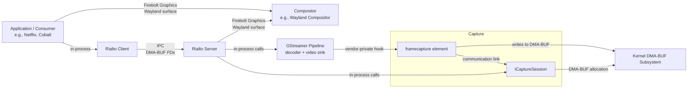

# SoC Video Frame Capture Specification

**Status:** Draft for review.

**Specification version:** 0.2

## Revision history

| Version | Status | What changed | What reviewers should check |
|---|---|---|---|
| 0.2 | Draft for review | Changed frame acquisition so the HAL returns each newly selected frame once instead of repeatedly returning the same slot. Clarified that several previously returned frames may remain locked at the same time. | Frame acquisition and release, behavior when there is no newer frame, slot exhaustion, seek/flush, and teardown. |
| 0.1 | Initial draft | Introduced the capture session, DMA-BUF pool, GStreamer attachment, frame selection, and lifetime contract. | Complete specification. |

### What changed in version 0.2

- `acquireCurrentFrame()` now returns `NO_NEW_FRAME` when the current scheduler selection has already been returned. In this case it does not change `outFrame` or create another lock.
- A successful acquisition still locks the returned slot. Different acquired frames may keep different slots locked concurrently until Rialto releases them.
- The HAL decides whether a frame is new from its scheduler state, not by comparing reusable slot indices.
- The seek, flush, slot-exhaustion, pipeline-teardown, and late-release rules now follow the new acquisition behavior.
- The conformance checks now cover repeated and concurrent acquisition, multiple locked slots, slot reuse, and post-teardown release.

Reviewers who already reviewed version 0.1 can focus on the areas named in the latest row above. The rest of the contract is unchanged except for supporting wording needed to keep those sections consistent.

---

## 0. System context and deployment model

This specification defines the contract between three actors in a media playback stack:



### Process and IPC boundaries

- **Application and Rialto Server** run in separate processes.
- **`ICaptureSession`** lives in the Rialto Server process.
- **Captured frames** cross the process boundary via DMA-BUF file descriptors.
- **The consumer** receives FDs and imports them into its own process context.
- **All HAL method calls** (`ICaptureSession` methods, `gst_frame_capture_attach()`/`detach()`) are in-process calls within Rialto Server.

### Contract scope

This specification defines the contract between:
- **Middleware layer team** (which owns Rialto Server and calls the HAL interfaces)
- The **SoC vendor** (which provides the decoder, `framecapture` element, and `ICaptureSession` implementation)
- The **Vendor layer team** (which integrates SoC vendor delivery into a vendor layer build)

The transport of captured frames beyond the capture-session interface (e.g., Rialto IPC, Wayland fd-passing) is out of scope.

---

## 1. Purpose

This specification defines how an SoC capture session and GStreamer element provide decoded clear-video frames to a Rialto Server.

`ICaptureSession` allocates and owns the DMA-BUF pool. The SoC scheduled-output path borrows that pool and writes STC-selected frames into available slots.

This adds to the existing SoC decode stack; it does not replace it.

## 2. Roles and responsibilities

| Role | Definition | Responsibilities |
|------|------------|------------------|
**Middleware layer team** (Platform integrator / Platform client / HAL user) | The RDK-E middleware team that owns the Rialto Server. | - Integrates with the compositor/consumer layer<br>- Calls `ICaptureSession` methods<br>- Calls `gst_frame_capture_attach()`/`detach()`<br>- Manages pipeline state and playback lifecycle
| **SoC vendor** | The hardware vendor providing the decoder, GStreamer elements, and HAL implementation. | - Provides the decoder GStreamer element<br>- Provides the `framecapture` GStreamer element<br>- Implements `ICaptureSession` including `createPool()`<br>- Provides the GStreamer integration (plugin registration) |
**Vendor layer team** (SoC integration) | The SoC vendor's packaging layer that integrates SoC vendor delivery into a vendor layer build. | - Registers vendor GStreamer plugins<br>- Defines the platform-wide DMA heap policy

## 3. Scope

### In scope

- Association with the SoC GStreamer element that owns native STC-based frame selection.
- Session-owned DMA-BUF pool allocation.
- Supplying pool slots to the vendor GStreamer element.
- Format, modifier, memory-region, dimension, crop, and colour metadata.
- Atomic current-frame acquisition, PTS, and write-completion synchronization.
- Per-acquisition retain/release behavior and capture-pool identity.
- Non-blocking behavior when capture slots are exhausted.
- Session and pool lifetime after GStreamer pipeline teardown.

### Out of scope

- GL texture, EGLImage, and Vulkan image creation.
- Protected-content capture.
- Final composition and display after frame handoff.
- Transport of captured frames beyond the capture-session interface.
- The mechanism used to construct the SoC implementation.

### 3.1 Terminology

The contract uses these terms exclusively:

| Term | Meaning |
|---|---|
| **Frame** | The video frame selected as current by the SoC's native STC scheduler, with PTS, visible region, and a reference to the slot containing its pixels. The HAL frame record does not allocate separate pixel memory; a successful acquisition returns it under the selected frame's single slot lock. |
| **Slot** | One reusable frame-storage region in the capture pool. Its memory regions may share DMA-BUF objects with other slots. Its `slotIndex` identifies it within the session's pool. |
| **DMA-BUF object** | One pool-owned DMA-BUF file descriptor and its total allocation size. One object may back one memory region, several regions, several slots, or the complete pool. |
| **DMA-BUF region** | One slot pixel region's reference to a pool-level DMA-BUF object, with byte offset, byte length, and stride. It is storage metadata, not a frame and does not own an FD. |
| **Pool** | The fixed DMA-BUF objects and logical slots owned by `ICaptureSession`. |

The document does not use “buffer” as a synonym for either slot or frame. “Decoder output buffer” is used only when referring to a vendor-native object outside the capture-pool contract.

### 3.2 Conceptual model

The five technical terms form a hierarchy:

```
Pool (collection of Slots)
    └── Slot (indexed position in Pool)
        └── DMA-BUF object (kernel buffer backing the Slot)
            └── DMA-BUF region (sub-region of the object, for multi-plane formats)
        └── Frame (decoded video content written to the Slot)
```

- A **Pool** contains multiple **Slots**.
- Each **Slot** is backed by one or more **DMA-BUF objects**.
- Each **DMA-BUF object** is divided into one or more **DMA-BUF regions** (for multi-plane formats like NV12).
- A **Frame** is the decoded video content written to a **Slot** at a specific STC selection.

## 4. Mandatory ownership model

The following ownership rule is normative:

> `ICaptureSession` allocates and owns its capture DMA-BUF pool. The vendor GStreamer element and hardware decoder may import and write those slots, but they do not own the backing allocation lifetime. Destroying the decoder, GStreamer element, or pipeline releases only decoder-side references and does not invalidate the pool.

```text
Middleware layer team
    └── owns shared ICaptureSession
          ├── owns capture pool
          │     ├── DMA-BUF object(s)
          │     └── slots → DMA-BUF regions within those objects
          └── owns frame-lock state

vendor GstElement / hardware decoder
    └── temporarily borrows and imports the pool
```

The decoder must not:

- allocate the authoritative capture pool as part of its own private lifecycle;
- free capture-pool backing;
- overwrite or reuse a retained slot;
- make pool validity depend on its own continued existence; or
- invalidate capture descriptors during transition to `GST_STATE_NULL`.

A platform whose decoder cannot write session-owned slots must provide a vendor capture-output stage that copies or converts decoded output into those slots. Correct lifetime behavior takes precedence over zero-copy operation.

## 5. Session provision and lifecycle

### 5.1 Session provision and initialization

The **Middleware layer team** obtains an `ICaptureSession` implementation from a vendor-supplied factory (provided by the Vendor layer team). No specific factory interface is required, but the platform must be able to obtain a session instance before the first capability query.

**Initialization timing (recommended):** `ICaptureSession` is initialized once per Rialto Server process startup, before the first playback request. The session persists across multiple playback sessions and pipeline instances to avoid DMA heap and DRM handle churn.

**Alternative:** The middleware may choose to destroy and recreate the session per playback or pipeline rebuild if that matches its requirements, at the cost of allocator churn.

**Process lifespan constraints:**
- `ICaptureSession` is scoped to the lifetime of the hosting Rialto Server process.
- In the containerized architecture, each app instance runs in its own container with its own Rialto Server instance, so the session is effectively app-instance-scoped.
- It is one-per-Rialto-Server-instance.
- Process restart or container shutdown requires re-initialization.

**Rationale:** Creating DMA heaps and opening DRM handles is expensive and causes memory fragmentation. Frequent pipeline rebuilds (e.g., per track, per codec, per resolution change) would incur significant allocator churn if the session is recreated each time. Persistence avoids this churn and improves performance for typical STB workloads.

**Session recreation:** The recommendation for persistence does not forbid session recreation. The middleware may destroy and recreate the session for configuration changes (format, capabilities) when necessary. The recommendation is about avoiding unnecessary churn on routine pipeline teardown/rebuild, not preventing recreation when actually needed.

The end-to-end middleware, capture-session and scheduled-output lifecycle is shown in `diagrams/pipeline-video-frame-capture-lifecycle-sequence.puml`.

### 5.2 Capture activity model

Capture in this specification is a **passive observer** of the decoder's STC scheduler. The decoder determines which frame is current based on its native STC-based presentation decision; capture observes that decision and returns the selected frame.

Capture starts implicitly when the decoder is active and stops when it is not. There is no explicit start/stop control on the capture session itself. This model matches consumer expectations (e.g., Netflix PGIO assumes a running pipeline is capturing without explicit start/stop calls) and avoids invalid state combinations such as stopped capture on a running pipeline or running capture on a stopped pipeline.

The middleware controls capture activity indirectly through pipeline state: when the decoder is producing frames, capture returns the current frame; when the decoder is stopped or idle, capture returns no frame.

## 6. Scheduled-output association and frame selection

Association with a GStreamer pipeline alone is insufficient. The session must reach the SoC video element that owns or can access the native STC-based presentation decision. This may be a video sink, a combined decoder/sink, or another scheduled-output element.

The integration uses a `framecapture` GStreamer element with the common contract in this specification. The **Middleware layer team** associates it with the scheduled-output element through `gst_frame_capture_attach()` defined in Section 9.2.

For every current frame returned by `acquireCurrentFrame()`, the SoC implementation uses the same STC and scheduling rules as its native video presentation path. Of the decoded frames available to that path, it captures the frame selected as current and therefore as close as possible to STC under those rules. Early frames remain held and late frames may be skipped according to the native scheduler.

`CapturedFrame.presentationTimeNs` is the selected frame's PTS in the timeline used for STC scheduling. The Middleware layer team does not compare candidate frame timestamps with STC or reproduce SoC scheduling. The session keeps the most recent successfully captured scheduler selection as its current frame until a newer selection is captured or the selection is temporarily invalidated during flush or seek.

The **SoC vendor** may supply both `framecapture` and `ICaptureSession`. How `framecapture` reaches the scheduler and obtains pixels from the decoder remains private to those components. It may use a direct plugin API, internal handle, linked pad, context, or query without exposing that mechanism to the caller.

Merely adding `framecapture` to the same bin does not establish association. The Middleware layer team does not access private GObject structures.

The GStreamer bridge is temporary. It does not own `ICaptureSession` or its pool and may be destroyed with the pipeline.

## 7. Capture value types

```cpp
enum class CaptureStatus : uint32_t
{
    OK,
    NO_NEW_FRAME,
    UNSUPPORTED,
    INVALID_ARGUMENT,
    NO_RESOURCES,
    NO_FRAME,
    FATAL_ERROR,
};

struct Size
{
    uint32_t width;
    uint32_t height;
};

struct Rectangle
{
    uint32_t x;
    uint32_t y;
    Size size;
};

struct CaptureCapabilities
{
    uint32_t size{sizeof(CaptureCapabilities)};
    uint32_t drmFormat;
    uint64_t drmModifier;
    Size maximumContentSize;
    uint32_t maximumSlots;
};

struct DmaBufObject
{
    int fd;
    uint64_t sizeBytes;
};

struct DmaBufRegion
{
    uint32_t dmaBufObjectIndex;
    uint64_t offsetBytes;
    uint64_t lengthBytes;
    uint32_t strideBytes;
};

struct CaptureSlot
{
    uint32_t slotIndex;
    std::vector<DmaBufRegion> regions;
};

struct CapturePool
{
    Size backingSize;
    std::vector<DmaBufObject> dmaBufs;
    std::vector<CaptureSlot> slots;
};

struct CapturedFrame
{
    uint32_t slotIndex;
    int64_t presentationTimeNs;
    Rectangle visibleRegion;
};
```

The final API must replace bare file descriptors with a native-handle type defining duplication and close ownership.

`CaptureSlot::slotIndex` equals its position in `CapturePool.slots`. Every `DmaBufRegion::dmaBufObjectIndex` identifies an entry in `CapturePool.dmaBufs`, and `offsetBytes + lengthBytes` must not exceed that object's `sizeBytes`. DMA-BUF region descriptors are immutable for the lifetime of the pool.

A single DMA-BUF object may be referenced by several regions and several slots. For example, one object may contain the backing for the complete frame pool, with each slot using different region offsets. Conversely, one slot may reference several DMA-BUF objects. Each exported allocation appears once in `CapturePool.dmaBufs`; sharing is expressed by reusing its index. The contract does not require a particular allocation arrangement.

A `CapturedFrame` resolves its storage through `CapturePool.slots[slotIndex].regions` and then `CapturePool.dmaBufs[dmaBufObjectIndex]`; it does not duplicate file descriptors or region layout. A transport sends the pool metadata once, then sends the slot index and frame metadata with each acquisition response.

## 8. Session interface

```cpp
class ICaptureSession
{
public:
    virtual ~ICaptureSession() = default;

    virtual bool getCapabilities(CaptureCapabilities &out) const = 0;

    virtual CaptureStatus createPool(
        uint32_t slotCount,
        CapturePool &outPool) = 0;

    virtual CaptureStatus acquireCurrentFrame(
        CapturedFrame &outFrame) = 0;

    virtual CaptureStatus releaseFrame(
        const CapturedFrame &frame) = 0;
};
```

`getCapabilities()` reports the implemented capture format, modifier, maximum supported content size, and maximum pool depth. It does not return alternative formats, allocation modes, or synchronization mechanisms.

`createPool()` allocates a session-owned pool containing the requested `slotCount` and synchronously returns the complete `CapturePool`. `slotCount` must be greater than zero and no greater than `CaptureCapabilities.maximumSlots`. The returned pool reports its actual backing size. It is called once per session. Success means the pool is ready to attach to the SoC GStreamer path.

**Pool creation ownership:** The **SoC vendor** implements `createPool()` as part of `ICaptureSession`. The vendor is responsible for:
- Selecting the DMA heap (e.g., `/dev/dma_heap/secure` vs. `/dev/dma_heap/system`)
- Choosing the allocator/layout (GBM, vendor-private, etc.)
- Validating `slotCount` against `maximumSlots` from `getCapabilities()`
- Validating `maximumContentSize` against hardware limits

The **Vendor layer team** is responsible for:
- Providing the platform-wide DMA heap policy to the SoC vendor (via build-time configuration or runtime parameters)
- Ensuring the vendor's allocation choices are compatible with the downstream consumer (e.g., compositor requirements)

`acquireCurrentFrame()` atomically examines the frame currently selected by the native STC scheduler. If that scheduler selection has not previously been returned by this session, the method locks its slot, marks the selection as returned, populates `outFrame`, and returns `OK`. If the current selection was already returned, it returns `NO_NEW_FRAME` without modifying `outFrame` or creating a lock. If no current captured frame exists, it returns `NO_FRAME` without modifying `outFrame`; this includes the period before first output and the interval after flush or seek until a new current frame is captured. `NO_NEW_FRAME` and `NO_FRAME` are normal results and require no matching release.

The SoC implementation determines whether a scheduler selection is new using private scheduler identity or equivalent internal state, not `slotIndex`; a released slot may later contain a different selection. The check, slot lock, returned-state update, and `outFrame` copy are one atomic operation. Concurrent calls for one current selection result in exactly one `OK`; every later call before a new selection is published returns `NO_NEW_FRAME`. Flush or seek invalidates the current selection and resets this comparison state without releasing previously acquired frames; the first successfully captured post-flush selection is new and returns `OK`.

Every `OK` acquisition establishes one lock for one distinct captured selection. Several previously acquired frames may therefore lock different slots concurrently, but there is at most one live frame lock per slot and one successful acquisition per captured selection. The Middleware layer team may share one acquired result internally and calls `releaseFrame()` once when its final use ends.

`releaseFrame(const CapturedFrame &frame)` releases the lock identified by `frame.slotIndex`. Every `OK` acquisition requires exactly one matching release. It rejects an out-of-range or currently unlocked slot. On successful release, that `CapturedFrame` and every retained copy of it become invalid and the caller must not use or release them again. The HAL is not required to distinguish a stale release from the valid owner after that slot has subsequently been reused. A slot cannot be written, reused, or associated with another frame while its lock remains active.

The **SoC vendor** supplies both `ICaptureSession` and the GStreamer integration. Scheduler notifications, writable-slot management, decoder handles, and copy/conversion details remain private between those components.

Capture begins implicitly when the attached GStreamer pipeline enters its playing state and stops updating current selection when the pipeline leaves the applicable state or detaches the pool. `ICaptureSession` has no independent start/stop state or callback loop.

No factory is implied by this interface.

## 9. GStreamer-to-session contract

The common API attaches the pool and session to `framecapture`; the **SoC vendor's implementation** must then provide these behaviors:

```text
identify the native scheduled-output path and its STC
accept and attach the complete session-owned CapturePool
obtain pixels for the scheduler's current frame
start and stop writes with GStreamer pipeline state
detach the pool before scheduled-output teardown
update the session's current frame: slot index, PTS, and visible region
```

### 9.1 Element identity

The **SoC vendor** provides a GStreamer element factory with the common name:

```text
framecapture
```

The element is a control/attachment element. The common contract does not require sink or source pads because some vendor decoders expose decoded output internally rather than through a GStreamer pad. A vendor implementation may add private pads when useful, but platform integration does not depend on them.

The element is instantiated through the normal GStreamer factory:

```cpp
GstElement *frameCapture =
    gst_element_factory_make("framecapture", nullptr);
```

Failure to create the element means Video Frame Capture is unavailable. It does not prevent normal video playback.

### 9.1.1 GStreamer plugin registration

The **SoC vendor** provides a GStreamer plugin that registers the `framecapture` element factory via the standard GStreamer plugin mechanism (`GST_PLUGIN_DEFINE`, `gst_element_register()`). The **Middleware layer team** ensures this plugin is loaded at Rialto Server startup.

### 9.1.2 Element insertion timing

**[TODO: Confirm with implementation]** The `framecapture` element is inserted into the pipeline bin during pipeline construction, before the decoder is linked to the video sink. The insertion happens after the decoder element is created but before `gst_element_link()` is called. The element is not part of the pad graph (it has no sink or source pads) and does not affect caps negotiation.

### 9.2 Common attachment API

The **SoC vendor** provides a C++-callable GStreamer integration header containing:

**Caller:** The **Middleware layer team** (Rialto Server) calls `gst_frame_capture_attach()` and `gst_frame_capture_detach()`. This is an in-process call within the Rialto Server process.

```cpp
CaptureStatus gst_frame_capture_attach(
    GstElement *frameCapture,
    GstElement *vendorVideoElement,
    ICaptureSession *session,
    const CapturePool &pool);

CaptureStatus gst_frame_capture_detach(
    GstElement *frameCapture);
```

`gst_frame_capture_attach()`:

- is called exactly once before the pipeline enters `PLAYING`;
- verifies that `frameCapture` is the SoC vendor's `framecapture` element;
- associates the SoC element that owns or exposes native STC-based frame selection;
- borrows `session`; it does not take ownership or extend session lifetime;
- consumes and validates the pool description synchronously;
- takes only the native references needed by the scheduled-output and decoder path;
- connects the session to private SoC current-selection updates;
- returns only after the pool and selection path are completely attached or attachment has failed; and
- leaves normal playback usable when it fails.

**Preconditions for `gst_frame_capture_attach()`:**
- The pipeline must be in the `NULL` or `READY` state.
- The decoder element must be created and added to the pipeline bin.
- The video sink must be created and added to the pipeline bin.
- Caps negotiation between decoder and sink may be pending or complete.

**Postconditions:**
- The `framecapture` element is added to the pipeline bin.
- The private hook between `framecapture` and the decoder is established.
- The capture pool is associated with the decoder.
- The pipeline state is unchanged (still `NULL` or `READY`).

`gst_frame_capture_detach()`:

- is idempotent and synchronous;
- prevents the scheduled-output path from starting another capture write;
- waits for or cancels every in-progress capture write;
- disconnects private current-selection updates;
- releases every SoC-side import and pool reference;
- does not release session-owned slot backing;
- does not invalidate the last current frame or any acquired frame; and
- returns only when the scheduled-output path and decoder can be destroyed safely.

The **Rialto Server** must keep `session`, `pool`, and `vendorVideoElement` valid until detach returns. The `framecapture` element holds a GStreamer reference to `vendorVideoElement` while attached and releases it during detach.

There are no common GObject properties, action signals, or bus messages for configuration. The typed attachment functions are the complete platform integration-facing GStreamer API. Decoder handles and any additional vendor calls remain private between the SoC vendor's element and session implementation.

### 9.3 GStreamer state behavior

| Element/pipeline state | Required capture behavior |
|---|---|
| `NULL` / `READY` | Pool may be attached; no capture writes occur |
| `PAUSED` | Pool remains attached; current capture selection does not advance |
| `PLAYING` | Capture changes in the scheduler's current selection into writable slots |
| Leaving `PLAYING` | Stop current-selection updates and complete/cancel in-progress writes |
| Teardown | Call `gst_frame_capture_detach()` before destroying the decoder or session |

State changes do not create or destroy the pool. `ICaptureSession` has no corresponding start/stop methods.

### 9.4 Interaction with GStreamer buffer pools

The session-owned capture pool is handed over via the `gst_frame_capture_attach()` C++ call, not via GStreamer's `ALLOCATION` query or `GstBufferPool` proposal mechanism. The capture pool is independent of the decoder↔sink link's buffer pool.

The decoder continues to negotiate its buffer pool with the video sink via the standard GStreamer mechanism. The capture pool is a side-channel that receives copies of decoded frames; it does not replace or interfere with the decoder's primary output path.

The capture pool does not participate in caps negotiation. The decoder and sink negotiate caps as usual. The capture pool must be capable of accepting frames in the negotiated format (this is a conformance requirement).


## 10. Current selection and slot ownership

The session tracks one current captured selection, whether that selection has been successfully acquired, and the set of slots locked by previously acquired frames.

A slot is writable only when no frame lock is active and no capture write is in progress. Multiple distinct acquired frames may lock different slots concurrently, but each slot has at most one live lock.

An unlocked current slot may be reused for a newer selection. Before writing it, the session atomically invalidates that current selection, so a concurrent `acquireCurrentFrame()` returns `NO_FRAME` rather than observing storage being overwritten.

When the native scheduler selects a different current frame, the SoC path captures it into a writable slot, completes private synchronization, assigns private selection identity, and makes that slot current and not yet acquired. Selection identity is independent of storage identity: a slot released from an older frame may later contain a new selection that must return `OK`.

`acquireCurrentFrame()` checks, locks, and marks the current selection as acquired in one atomic operation. The first call for that selection returns `OK`; later calls return `NO_NEW_FRAME` without returning its `slotIndex` again or changing lock state. The slot therefore cannot become writable between selection and locking.

`releaseFrame()` removes the lock established by one successful acquisition. Once release succeeds, that `CapturedFrame` is invalid and the slot may later hold a different frame. Releasing one slot has no effect on other acquired slots.

If no slot is writable when the scheduler advances, the new capture selection is omitted. The previous captured selection remains current; if it was already acquired, `acquireCurrentFrame()` returns `NO_NEW_FRAME`. Video decode, native presentation, audio presentation, and STC progression continue without waiting. Once capacity returns, the next captured selection represents the then-current SoC frame and returns `OK` on its first acquisition; missed intermediate selections are not replayed.

## 11. Pipeline-independent lifetime

The session lifetime is independent of the GStreamer pipeline:

```text
GStreamer pipeline lifetime
    framecapture
        → follows native STC-based selection
        → updates the session's current captured slot
        → stops and detaches at pipeline teardown

Capture session lifetime
    ICaptureSession
        → owns the pool
        → owns the last current selection
        → tracks selected-frame locks
        → accepts releases after pipeline teardown
```

Pipeline teardown proceeds in this order:

1. stop new current-selection writes;
2. wait for or cancel any in-progress capture write;
3. detach the pool from the scheduled-output and decoder path;
4. release SoC-side imports and references;
5. destroy `framecapture`, the video path, and the GStreamer pipeline;
6. retain `ICaptureSession`, its current selection, and all locked frames;
7. permit an unacquired final selection to be acquired once, return `NO_NEW_FRAME` after it has been acquired, and continue accepting late releases; and
8. destroy the pool only after the session closes and every frame lock has been released.

Destroying the media pipeline stops current-selection updates but does not invalidate the last current frame or an acquired frame.

## 12. Post-detach behavior

After `gst_frame_capture_detach()` succeeds:

- no scheduled-output path is attached;
- the current selection no longer advances;
- a final selection not previously acquired may return `OK` and become locked once;
- an already acquired final selection returns `NO_NEW_FRAME` without another lock;
- `NO_FRAME` is returned if detach leaves no valid current selection;
- existing locked frames remain valid;
- late `releaseFrame()` calls are accepted; and
- pool destruction waits for every frame lock to be released.

The specification does not require a specific internal session state. Reattaching a detached session to a different video path is outside this specification.

## 13. DMA-BUF lifetime

Every pool allocation must follow normal reference-counted DMA-BUF lifetime semantics:

- decoder imports are temporary references;
- any transport duplicates descriptors with explicit ownership;
- EGL/Vulkan imports may retain backing independently;
- decoder teardown drops only decoder references; and
- backing is reclaimed only after all pool and imported references are released.

A vendor allocator that forcibly reclaims exported backing when the decoder is destroyed is non-conformant.

## 14. Synchronization

A successful `acquireCurrentFrame()` guarantees that the returned frame was selected by the native STC scheduler and that all writes, cache maintenance, and platform-private synchronization are complete. The returned slot is retained and immediately safe to import and sample.

`releaseFrame()` guarantees that the caller's final shared use of the selected frame has ended. The session may then use its slot for a newer capture selection.

Any native fences required between the vendor decoder, capture session, graphics driver, or GStreamer bridge remain private to the **SoC vendor's implementation**. They are not capabilities or values in this HAL.

## 15. Fixed capture layout

Each platform implements one capture layout and reports it through `getCapabilities()`. The session does not negotiate between alternative DRM formats, modifiers, allocation modes, or synchronization models. The created pool provides the authoritative DMA-BUF region layout.

The pool is allocated once with:

- the implemented DRM format and modifier;
- the same region count and pixel layout for every slot, while DMA-BUF object indices and offsets may differ;
- an actual backing size returned in `CapturePool`; and
- the slot count requested by `createPool()`.

Every slot uses `CapturePool.backingSize`, and `CapturePool.slots.size()` equals the requested count. The requested count must not exceed `CaptureCapabilities.maximumSlots`.

The capture format, modifier, region layout, pool backing size, and allocated slot count remain fixed until the session is closed. Resolution or crop changes update `CapturedFrame.visibleRegion`; they do not replace the pool.

If content exceeds `CaptureCapabilities.maximumContentSize` or cannot be represented by the implemented capture layout, capture returns `UNSUPPORTED` or `FATAL_ERROR` and stops updating its current selection. Normal playback remains available. Runtime capture-pool replacement is outside this specification. One `ICaptureSession` owns one pool for its complete lifetime.

## 16. Vendor integration information required

The behavioral requirements are fixed by this specification. Each SoC vendor supplies only the implementation-specific information needed to integrate and review its implementation:

1. the GStreamer element passed to `gst_frame_capture_attach()` and the private mechanism by which `framecapture` reaches its STC-based scheduler and frame pixels;
2. whether the scheduled-output path writes session-owned slots directly or uses a vendor copy/conversion path;
3. the concrete `CaptureCapabilities` values returned on that SoC;
4. how the session privately identifies scheduler selections and atomically returns and locks each selection at most once during `acquireCurrentFrame()`;
5. the private mechanism used to track multiple locked slots and make an unlocked slot safe for capture reuse; and
6. any implementation constraints that do not fit the fixed contract and therefore make Video Frame Capture unsupported.

The vendor is not being asked whether decode may stop under slot exhaustion or whether the pool may be destroyed with the decoder. Those are mandatory requirements below.

### 16.1 Decoder internal changes

The **SoC vendor** must modify the decoder implementation to expose a hook that allows the `framecapture` element to obtain the current frame's pixels. The mechanism for this hook is vendor-specific and outside the scope of this specification. The only requirement is that the hook does not interfere with normal decoder scheduling, STC progression, or audio presentation.

## 17. Conformance and acceptance gates

An SoC implementation is conformant only when all of the following are true:

| # | Requirement | Section |
|---|-------------|---------|
| 1 | `framecapture` associates with the SoC element that owns or exposes native STC-based frame selection | §6 |
| 2 | Frame selection uses the same STC and scheduling rules as native video presentation | §6 |
| 3 | The session's current frame is the successfully captured scheduler selection closest to STC, with PTS in the scheduler's timeline | §6 |
| 4 | `createPool(slotCount)` accepts every valid count up to `maximumSlots` and returns a complete session-owned pool synchronously | §8 |
| 5 | The scheduled-output path writes directly into that pool or a vendor copy/conversion path populates it | §4 |
| 6 | The returned DMA-BUF objects and region descriptors are valid for the reported format, modifier and backing size, and are importable through every required client graphics path | §7 |
| 7 | `acquireCurrentFrame()` atomically checks, locks and marks a previously unacquired current selection, returning `OK` exactly once for that selection | §8, §10 |
| 8 | Repeated acquisition before a newer selection returns `NO_NEW_FRAME`, leaves `outFrame` unchanged and creates no lock | §8, §10 |
| 9 | The HAL determines selection newness independently of `slotIndex`, so reuse of a released slot for a newer selection returns `OK` | §8, §10 |
| 10 | Multiple distinct acquired frames may lock different slots concurrently; releasing one does not affect another | §8, §10 |
| 11 | Every `OK` acquisition requires exactly one matching `releaseFrame()`, after which that `CapturedFrame` is invalid | §8, §10 |
| 12 | An active frame lock prevents slot reuse, and reusing an unlocked current slot atomically invalidates it before writing | §10 |
| 13 | A successful acquisition returns a slot immediately safe for graphics import and sampling | §14 |
| 14 | When no slot is writable, the new capture selection is omitted, acquisition returns `NO_NEW_FRAME`, and video decode and native presentation continue without waiting | §10 |
| 15 | Slot exhaustion does not stop audio presentation or STC progression, and missed intermediate selections are not replayed | §10 |
| 16 | The session-owned DMA-BUF pool remains valid after the decoder, `framecapture`, and GStreamer pipeline are destroyed | §11, §12 |
| 17 | Decoder teardown releases only decoder-side imports and cannot reclaim session-owned backing | §4, §12 |
| 18 | A final selection may be acquired once after pipeline teardown; an already acquired final selection returns `NO_NEW_FRAME` | §11, §12 |
| 19 | Locked frames and late releases remain valid after pipeline teardown | §11, §12 |
| 20 | Content within `CaptureCapabilities.maximumContentSize` requires no runtime pool replacement | §15 |
| 21 | Contract tests cover STC selection, atomic single delivery, `NO_NEW_FRAME`, concurrent acquisition, slot reuse, multiple simultaneous locks, invalid/double release, capabilities, exhaustion, synchronization, teardown, and late release | — |

Failure of any mandatory gate means Video Frame Capture is unsupported on that implementation; it does not permit a weakened lifetime or playback-continuity contract.

---

# Appendix A — Initialization and lifetime example

This appendix illustrates one in-process integration. `PlatformVideoFrameCapture` represents **Rialto Server** code outside the HAL. Private client-transport operations appear only as comments. All vendor-facing types and calls used by the example are defined in Sections 7–9. The normative points are that `ICaptureSession` is injected rather than created through a capture HAL factory, `framecapture` borrows it, pool creation completes synchronously before GStreamer attachment, and pipeline teardown detaches without destroying the session.

## A.1 Example platform HAL usage

The following non-normative example shows how a platform might receive an `ICaptureSession`, create its pool, attach `framecapture`, and forward pool/frame information through its own transport. It does not prescribe the SoC implementation:

```cpp
class PlatformVideoFrameCapture final
{
public:
    explicit PlatformVideoFrameCapture(
        std::shared_ptr<ICaptureSession> session)
        : m_session{std::move(session)}
    {
    }

    bool initialize(
        GstElement *pipeline,
        GstElement *vendorVideoElement,
        uint32_t requestedSlotCount)
    {
        if (!m_session || !pipeline || !vendorVideoElement)
            return false;

        if (!m_session->getCapabilities(m_capabilities))
            return false;

        if (requestedSlotCount == 0 ||
            requestedSlotCount > m_capabilities.maximumSlots)
        {
            return false;
        }

        if (m_session->createPool(
                requestedSlotCount,
                m_pool) != CaptureStatus::OK)
        {
            return false;
        }

        m_bridge = gst_element_factory_make("framecapture", nullptr);
        if (!m_bridge)
            return false;

        gst_bin_add(GST_BIN(pipeline), m_bridge);

        if (gst_frame_capture_attach(
                m_bridge,
                vendorVideoElement,
                m_session.get(),
                m_pool) != CaptureStatus::OK)
        {
            gst_bin_remove(GST_BIN(pipeline), m_bridge);
            m_bridge = nullptr;
            return false;
        }

        // Publish m_capabilities and m_pool through the caller's transport
        // before reporting capture attachment complete.
        m_pipeline = pipeline;
        m_vendorVideoElement = vendorVideoElement;
        return true;
    }

    CaptureStatus acquireCurrentFrame(CapturedFrame &frame)
    {
        return m_session->acquireCurrentFrame(frame);
    }

    CaptureStatus releaseFrame(const CapturedFrame &frame)
    {
        return m_session->releaseFrame(frame);
    }

private:
    CaptureCapabilities m_capabilities;
    CapturePool m_pool;
    std::shared_ptr<ICaptureSession> m_session;
    GstElement *m_pipeline{nullptr};
    GstElement *m_vendorVideoElement{nullptr};
    GstElement *m_bridge{nullptr};
};
```

`gst_frame_capture_attach()` is the common typed in-process API defined in Section 9.2. It is not a consumer-facing API and does not expose the session through a generic GObject pointer property.

At the end of `initialize()`:

```text
PlatformVideoFrameCapture owns ICaptureSession and the returned pool description
ICaptureSession owns the slot backing
capture client has received the complete pool description
framecapture bridge borrows ICaptureSession and the pool
framecapture bridge targets the exact vendor video element
capture begins only when the pipeline enters PLAYING
```

### A.1.1 Resolving pool and frame information

The Middleware layer team sends the pool layout once. Each region identifies a pool-level DMA-BUF object and a byte range within it:

```cpp
void publishPoolOnce(
    const CaptureCapabilities &capabilities,
    const CapturePool &pool)
{
    // Publish capabilities.drmFormat and capabilities.drmModifier.
    // Publish pool.backingSize.

    for (const DmaBufObject &dmaBuf : pool.dmaBufs)
    {
        // Duplicate dmaBuf.fd for the receiving process and publish
        // dmaBuf.sizeBytes with it.
    }

    for (const CaptureSlot &slot : pool.slots)
    {
        for (const DmaBufRegion &region : slot.regions)
        {
            const DmaBufObject &dmaBuf =
                pool.dmaBufs.at(region.dmaBufObjectIndex);

            // Publish slot.slotIndex, region.dmaBufObjectIndex,
            // region.offsetBytes, region.lengthBytes and
            // region.strideBytes. dmaBuf identifies the FD that the
            // receiving process imports for this region.
        }
    }
}
```

When a frame is requested, the Middleware layer team resolves the returned slot against that cached pool:

```cpp
CaptureStatus acquireForConsumer(
    ICaptureSession &session,
    const CapturePool &pool,
    CapturedFrame &frame)
{
    CaptureStatus status = session.acquireCurrentFrame(frame);
    if (status != CaptureStatus::OK)
        return status;

    const CaptureSlot &slot =
        pool.slots.at(frame.slotIndex);

    for (const DmaBufRegion &region : slot.regions)
    {
        const DmaBufObject &dmaBuf =
            pool.dmaBufs.at(region.dmaBufObjectIndex);

        // The receiving process already has a duplicate of dmaBuf.fd.
        // It resolves that object with region.offsetBytes,
        // region.lengthBytes and region.strideBytes.
    }

    // Send only frame.slotIndex, frame.presentationTimeNs and
    // frame.visibleRegion for this acquisition.
    return CaptureStatus::OK;
}

CaptureStatus releaseFromConsumer(
    ICaptureSession &session,
    const CapturedFrame &frame)
{
    return session.releaseFrame(frame);
}
```

An `OK` response sends only `slotIndex`, `presentationTimeNs` and `visibleRegion`; it does not resend DMA-BUF handles, backing size, format, modifier, or region layout. `NO_NEW_FRAME` and `NO_FRAME` send status only. The Middleware layer team retains each successfully returned `CapturedFrame` until its final shared consumer use ends, then passes that same object to `releaseFrame()`.


## A.2 Initialization failure behavior

| Failure | Required result |
|---|---|
| No injected session | Capture creation fails; playback remains available without capture |
| `createPool()` fails | No bridge is attached and no pool is published |
| Bridge creation fails | Session remains valid but unattached; capture creation fails |
| Decoder association fails | Bridge is removed; decoder pipeline remains usable |
| Pool allocation fails | Capture reports `NO_RESOURCES`; normal playback continues |
| Decoder pool import fails | The unattached pool is discarded; normal playback continues |
| Pipeline tears down during allocation | Allocation is cancelled or retained unattached and then discarded; no decoder write begins |
| Caller disappears while frames are locked | Its transport releases every frame lock before session destruction |

