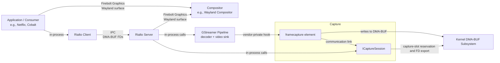

# SoC Video Frame Capture Specification

**Status:** Draft for review.

**Specification version:** 0.3

## Revision history

| Version | Status | What changed | What reviewers should check |
|---|---|---|---|
| 0.3 | Draft for review | Separated frame-plane layout, DMA-BUF allocations, and per-acquisition handles; standardized GStreamer integration on vendor `playbin` policy; made capability queries status-based; defined paused capture after decoder consumption; strengthened plane-length validation. | Playbin attachment responsibilities, capability failures, paused/flush behavior, plane bounds, FD export and IPC transport. |
| 0.2 | Draft for review | Changed frame acquisition so the HAL returns each newly selected frame once instead of repeatedly returning the same slot. Clarified that several previously returned frames may remain locked at the same time. | Frame acquisition and release, behavior when there is no newer frame, slot exhaustion, flush, and teardown. |
| 0.1 | Initial draft | Introduced the capture session, DMA-BUF pool, GStreamer attachment, frame selection, and lifetime contract. | Complete specification. |

### What changed in version 0.3

- `DmaBufObject` no longer includes an `fd` field; it describes only the size of a DMA-BUF allocation.
- Each `CaptureSlotLayout` has one explicitly indexed `FramePlane` per DRM plane. Different planes may reference the same `DmaBufObject` or different objects.
- `CapturedFrame::exportedDmaBufs` contains one `ExportedDmaBuf` for each distinct object referenced by the acquired slot; each entry pairs its process-local FD with the corresponding object index.
- Single-object, shared-object multiplane, multi-object, and mixed layouts are represented without conversion.
- `createPool()` returns pool metadata without DMA-BUF file descriptors.
- `acquireCurrentFrame()` crystallizes and exports DMA-BUF file descriptors for the acquired slot and includes them in the response.
- Descriptor-export failure is all-or-nothing: partial FDs and provisional lock state are rolled back, `outFrame` is unchanged, and transient `NO_RESOURCES` failures leave the selection retriable.
- IPC transport sends pool metadata once (without FDs), then sends FDs with each frame acquisition.
- This model accommodates SoC implementations with larger internal pools where FDs are allocated/exported on-demand.
- The SoC vendor's `playbin` policy is the single GStreamer construction and typed-attachment integration path; Middleware does not wire a custom pipeline.
- `getCapabilities()` returns `CaptureStatus` and leaves output unchanged on failure.
- Capture while paused requires an existing native selection established by decoder consumption through discard, explicit video-frame render, or playback; state alone does not create a frame.
- `FramePlane::lengthBytes` is retained for overflow-safe byte-range validation.

### What changed in version 0.2

- `acquireCurrentFrame()` now returns `NO_NEW_FRAME` when the current scheduler selection has already been returned. In this case it does not change `outFrame` or create another lock.
- A successful acquisition still locks the returned slot. Different acquired frames may keep different slots locked concurrently until Rialto releases them.
- The HAL decides whether a frame is new from its scheduler state, not by comparing reusable slot indices.
- The flush, slot-exhaustion, pipeline-teardown, and late-release rules now follow the new acquisition behavior.
- The conformance checks now cover repeated and concurrent acquisition, multiple locked slots, slot reuse, and post-teardown release.

Reviewers who already reviewed version 0.1 can focus on the areas named in the latest row above. The rest of the contract is unchanged except for supporting wording needed to keep those sections consistent.

---

## 0. System context and deployment model

This specification defines the contract between three actors in a media playback stack:


```mermaid
graph LR
    App[Application / Consumer<br/>e.g., Netflix, Cobalt] -->|in-process| RC[Rialto Client]
    RC -->|IPC<br/>DMA-BUF FDs| RS[Rialto Server]
    RS -->|Firebolt Graphics<br/>Wayland surface| Comp[Compositor<br/>e.g., Wayland Compositor]
    App -->|Firebolt Graphics<br/>Wayland surface| Comp
    RS -->|in-process calls| GS[GStreamer Pipeline<br/>decoder + video sink]
    subgraph Capture
        ICS[ICaptureSession]
        FC[framecapture element]
    end
    RS -->|in-process calls| ICS
    GS -->|vendor-private hook| FC
    FC -->|communication link| ICS
    ICS -->|capture-slot reservation and FD export| Kernel[Kernel DMA-BUF Subsystem]
    FC -->|writes to DMA-BUF| Kernel
```

### Process and IPC boundaries

- **Application and Rialto Server** run in separate processes.
- **`ICaptureSession`** lives in the Rialto Server process.
- **Captured frames** cross the process boundary via DMA-BUF file descriptors.
- **The consumer** receives FDs and imports them into its own process context.
- **All HAL method calls** (`ICaptureSession` methods, `gst_frame_capture_attach()`/`detach()`) are in-process calls within Rialto Server.

### Contract scope

This specification defines the contract between:
- **Middleware layer team** (which owns Rialto Server and calls the HAL interfaces)
- The **SoC vendor** (which provides the decoder, `framecapture` element, and `ICaptureSession` implementation)
- The **Vendor layer team** (which integrates SoC vendor delivery into a vendor layer build)

The concrete wire encoding and transport mechanism beyond the capture-session interface (for example Rialto IPC or Wayland fd-passing) are out of scope. Descriptor ownership, cleanup and frame-lock behavior at that boundary are in scope because the HAL contract must remain leak-free and unambiguous on transfer success or failure.

---

## 1. Purpose

This specification defines how an SoC capture session and GStreamer element provide decoded clear-video frames to a Rialto Server.

`ICaptureSession` provisions the capture slots and tracks their ownership while frames are retained. The SoC vendor chooses how those slots are backed and supplied to the scheduled-output path.

This adds to the existing SoC decode stack; it does not replace it.

## 2. Roles and responsibilities

| Role | Definition | Responsibilities |
|------|------------|------------------|
| **Middleware layer team** (Platform integrator / Platform client / HAL user) | The RDK-E middleware team that owns the Rialto Server. | - Integrates with the compositor/consumer layer<br>- Obtains the pipeline-scoped `ICaptureSession` and calls its methods<br>- Supplies the session and pool to platform playback setup<br>- Transports private pool/frame metadata and descriptors<br>- Manages pipeline state, frame locks, and playback lifecycle |
| **SoC vendor** | The hardware vendor providing the decoder, GStreamer elements, HAL implementation, and playback policy. | - Implements `ICaptureSession` including `createPool()`<br>- Provides the `framecapture` factory/plugin<br>- Provides the required `playbin` policy/configuration<br>- Creates/inserts `framecapture`, identifies scheduled output, and invokes typed attach/detach at the required lifecycle points |
| **Vendor layer team** (SoC integration) | The SoC vendor's packaging layer that integrates SoC vendor delivery into a vendor layer build. | - Packages and registers the vendor GStreamer plugin and `playbin` policy<br>- Supplies applicable platform integration constraints |

## 3. Scope

### In scope

- Association with the SoC GStreamer element that owns native STC-based frame selection.
- Capture-slot reservation and DMA-BUF metadata.
- Supplying pool slots to the vendor GStreamer element.
- Format, modifier, frame-plane, DMA-BUF object, dimension, crop, and colour metadata.
- Atomic current-frame acquisition, PTS, and write-completion synchronization.
- Per-acquisition retain/release behavior and capture-pool identity.
- Non-blocking behavior when capture slots are exhausted.
- Session and pool lifetime after GStreamer pipeline teardown.

### Out of scope

- GL texture, EGLImage, and Vulkan image creation.
- Protected-content capture.
- Final composition and display after frame handoff.
- Concrete wire encoding and IPC implementation beyond the capture-session interface; descriptor ownership and failure cleanup remain in scope.
- The mechanism used to construct the SoC implementation.

### 3.1 Terminology

The contract uses these terms exclusively:

| Term | Meaning |
|---|---|
| **Frame** | The video frame selected as current by the SoC's native STC scheduler, with PTS, visible region, and a reference to the slot layout describing its planes. A successful acquisition returns it under one slot lock. |
| **Slot layout** | The immutable plane layout for one reusable frame-storage slot. Its `slotIndex` identifies it within the session's pool. |
| **Frame plane** | One logical DRM image plane, identified by plane index, that occupies a byte range within one DMA-BUF object. It describes layout and does not own an FD. |
| **DMA-BUF object** | One DMA-BUF allocation, identified independently from its planes and described by its total size. One object may back one plane, several planes, several slots, or the complete pool. |
| **Exported DMA-BUF** | One process-local FD handle paired with the identity of the DMA-BUF object it accesses. It is created/exported on demand for an acquisition and is not object identity or plane metadata. |
| **Pool** | The session's DMA-BUF object metadata and logical slot layouts. Pool metadata contains no pre-created FDs; one FD for each distinct object required by a slot is exported only when its frame is acquired. |

The document does not use “buffer” as a synonym for either slot or frame. “Decoder output buffer” is used only when referring to a vendor-native object outside the capture-pool contract.

### 3.2 Conceptual model

The relationships are directional and do not imply one-to-one cardinality:

```
Frame (selected content and timing)
  └── Slot layout
       ├── Frame plane 0 ──references──> DMA-BUF object A ──exported as──> FD for A
       ├── Frame plane 1 ──references──> DMA-BUF object A ──same object, no second FD
       └── Frame plane 2 ──references──> DMA-BUF object B ──exported as──> FD for B
```

- A **Frame** is decoded content written to one reusable slot at a specific STC selection.
- Its **slot layout** contains one logical record for each DRM plane.
- Each **frame plane** references exactly one **DMA-BUF object** and describes its byte range and stride within that allocation.
- Several planes may reference the same object at different offsets, or each plane may reference a different object. Mixed arrangements are valid.
- A successful acquisition exports one FD for each distinct object referenced by the selected slot, never one FD per plane by implication.
- The process-local FD value is not object identity. `dmaBufObjectIndex` is the join key between plane layout and exported handle records.

## 4. Mandatory ownership model

The following behavior is normative; the allocation strategy is an SoC vendor decision:

> `ICaptureSession` provisions the capture slots and owns their retention/lock state. The SoC vendor may back them with decoder DPB buffers, a separate capture pool, or another implementation. Regardless of strategy, a locked slot's contents must remain valid and must not be overwritten until its matching `releaseFrame()`. Pipeline teardown must not invalidate an outstanding acquired frame; resources needed to complete its late release remain valid until the session is closed.

```text
Middleware layer team
    └── manages pipeline-scoped ICaptureSession
          ├── tracks capture-slot reservation and frame locks
          └── publishes pool object and plane metadata

SoC vendor / hardware decoder
    └── selects backing strategy and provides scheduled-output integration
```

The decoder and capture path must not overwrite or reuse a retained slot, invalidate an acquired frame during pipeline teardown, or allow capture-slot exhaustion to block normal decode, presentation, audio, or STC progression. How the SoC vendor meets these requirements, including whether it reserves DPB slots or supplies separate backing, is implementation-specific.

## 5. Session provision and lifecycle

### 5.1 Session provision and initialization

The **Middleware layer team** obtains an `ICaptureSession` implementation from a vendor-supplied factory (provided by the Vendor layer team). No specific factory interface is required, but the platform must be able to obtain a session instance before the first capability query.

**Pipeline scope:** Each video pipeline using Video Frame Capture has a dedicated `ICaptureSession`. The session tracks one set of capture-slot reservations and is attached only to that pipeline. A detached session must not be attached to another video pipeline; a new pipeline requires a new session.

**Close timing:** Pipeline teardown detaches the GStreamer capture path and stops writes, but the middleware keeps the session alive while it handles any permitted final selection and releases every outstanding acquired frame. The middleware closes/destroys the session only after the final-acquisition opportunity has completed, become unavailable, or been explicitly abandoned and all frame locks have been released. The common interface has no separate `close()` method; ending the session object's lifetime is the close operation, and any vendor-specific shutdown must complete as part of that teardown.

The session may therefore outlive its GStreamer pipeline when retained frames remain, but it does not persist for reuse across pipeline instances. Process restart or container shutdown also requires session teardown.

The end-to-end middleware, capture-session and scheduled-output lifecycle is shown in `diagrams/pipeline-video-frame-capture-lifecycle-sequence.puml`.

### 5.2 Capture activity model

Capture is a **passive observer** of the decoder's native STC scheduler. It exposes a current selection only after the decoder has consumed data and the native scheduler has established a display selection; GStreamer state alone does not create one.

There is no independent capture start/stop control. Decoder consumption may be driven by `discardUntilPosition()`, `renderVideoFrame()`, or normal `PLAYING`. While `PAUSED`, a valid selection established by one of those paths—or retained after subsequently pausing playback—remains at the stationary STC display point. Its first acquisition returns `OK`; later acquisitions return `NO_NEW_FRAME` until the native scheduler publishes another selection. If no decoder output has established a selection, including after a flush, acquisition returns `NO_FRAME` even when the pipeline is `PREROLLING` or `PAUSED`.

Pipeline `flush()` invalidates the current selection and returned-selection comparison state without releasing previously acquired frames. A new selection appears only after a decoder-consuming path causes the native scheduler to publish one.

## 6. Scheduled-output association and frame selection

Association with a GStreamer pipeline alone is insufficient. The session must reach the SoC video element that owns or can access the native STC-based presentation decision. The **SoC vendor's playbin policy** identifies that scheduled-output path, creates/inserts the common `framecapture` element, and invokes the typed attachment API defined in Section 9.2 with the session and pool supplied for that playback instance.

The Middleware layer team does not construct or wire a vendor GStreamer pipeline, locate private video elements, or access private GObject structures. It supplies the pipeline-scoped session and pool to platform playback setup; the vendor playbin policy owns element creation, scheduled-output association, and detach-before-teardown sequencing.

For every current frame returned by `acquireCurrentFrame()`, the SoC implementation uses the same STC and scheduling rules as its native video presentation path. Capture can publish only a selection for which the decoder has consumed data. That may occur through `discardUntilPosition()`, `renderVideoFrame()`, or normal playback. Capture does not select a frame independently from the native scheduler or infer one from GStreamer state alone.

`CapturedFrame.presentationTimeNs` is the selected frame's PTS in the timeline used for STC scheduling. The Middleware layer team does not compare candidate timestamps with STC or reproduce SoC scheduling. The session retains the most recent successfully captured scheduler selection until a newer selection is captured or pipeline `flush()` invalidates it. A flush does not release previously acquired frames.

How `framecapture` reaches the scheduler and obtains pixels remains private to the SoC vendor's playbin policy, element, and `ICaptureSession` implementation. Merely creating or adding `framecapture` does not establish association; typed attachment must complete. The bridge borrows the session and pool and may be destroyed with the pipeline after detach.

## 7. Capture value types

```cpp
enum class CaptureStatus : uint32_t
{
    OK,
    NO_NEW_FRAME,
    UNSUPPORTED,
    INVALID_ARGUMENT,
    NO_RESOURCES,
    NO_FRAME,
    FATAL_ERROR,
};

struct Size
{
    uint32_t width;
    uint32_t height;
};

struct Rectangle
{
    uint32_t x;
    uint32_t y;
    Size size;
};

struct CaptureCapabilities
{
    uint32_t size{sizeof(CaptureCapabilities)};
    uint32_t drmFormat;
    uint64_t drmModifier;
    Size maximumContentSize;
    uint32_t maximumSlots;
};

struct DmaBufObject
{
    uint32_t objectIndex;
    uint64_t sizeBytes;
};

struct FramePlane
{
    uint32_t planeIndex;
    uint32_t dmaBufObjectIndex;
    uint64_t offsetBytes;
    uint64_t lengthBytes;
    uint32_t strideBytes;
};

struct CaptureSlotLayout
{
    uint32_t slotIndex;
    std::vector<FramePlane> planes;
};

struct ExportedDmaBuf
{
    uint32_t dmaBufObjectIndex;
    int fd;
};

struct CapturePool
{
    Size backingSize;
    std::vector<DmaBufObject> dmaBufObjects;
    std::vector<CaptureSlotLayout> slotLayouts;
};

struct CapturedFrame
{
    uint32_t slotIndex;
    int64_t presentationTimeNs;
    Rectangle visibleRegion;
    std::vector<ExportedDmaBuf> exportedDmaBufs;
};
```

`CapturePool.backingSize` describes the dimensions/capacity of each logical slot for the selected capture layout. It does not require `ICaptureSession` to allocate new physical backing; the SoC vendor may satisfy the slot reservation using its selected backing strategy.

The final API must replace bare file descriptors with a native-handle type defining duplication and close ownership.

`CaptureSlotLayout::slotIndex` equals its position in `CapturePool.slotLayouts`. `DmaBufObject::objectIndex` values are unique, contiguous from zero, and equal their positions in `CapturePool.dmaBufObjects`. A slot layout contains exactly one `FramePlane` for each DRM plane required by `CaptureCapabilities::drmFormat`; `planeIndex` values are unique, contiguous from zero, and identify the plane numbers used by DRM/KMS, EGL DMA-BUF import, and Vulkan DRM-modifier import.

Every `FramePlane::dmaBufObjectIndex` identifies exactly one `DmaBufObject`. `lengthBytes` describes the complete byte extent used to validate that plane within the allocation; it need not be passed directly to EGL or Vulkan. Validation must avoid addition overflow by requiring `offsetBytes <= sizeBytes` and `lengthBytes <= sizeBytes - offsetBytes`, and the resulting range and `strideBytes` must be valid for the reported format/layout. Plane and object metadata are immutable for the pool lifetime. Modifier-private auxiliary storage that is not a separately addressable DRM plane remains part of its DMA-BUF allocation; a future separately addressable component requires an explicit contract extension rather than overloading `FramePlane`.

A `CapturedFrame` resolves its layout through `CapturePool.slotLayouts[slotIndex].planes`. On `OK`, `exportedDmaBufs` contains exactly one entry for every distinct `dmaBufObjectIndex` referenced by those planes, contains no duplicate or unrelated object, and can appear in any order. The object index—not the numeric FD—is the join key. An FD is a process-local handle and may have a different numeric value after IPC transfer. Plane count, object count, and FD count are therefore independent.

The pool metadata is sent once without FDs. The actual handles are crystallized and exported only when a frame is acquired. The HAL caller owns every returned FD and closes it after IPC transfer or transfer failure. The receiving process owns its transferred copies and closes them after graphics import has taken its own reference or consumed the handle. Closing an FD does not release the HAL frame lock, and `releaseFrame()` identifies the acquired slot lock without consulting FD values.

### 7.1 Valid frame representations

The following examples use illustrative process-local FD values. Each object appears once in `dmaBufObjects`; each successful acquisition exports each referenced object once.

**Example A — one plane, one object, one FD**

```text
plane 0 ──> object 0 ──> FD 10
```

```cpp
dmaBufObjects = {{.objectIndex = 0, .sizeBytes = S}};
planes = {{.planeIndex = 0, .dmaBufObjectIndex = 0,
           .offsetBytes = 0, .lengthBytes = S, .strideBytes = P}};
exportedDmaBufs = {{.dmaBufObjectIndex = 0, .fd = 10}};
```

**Example B — two planes sharing one object and one FD**

```text
plane 0 ──> object 0 @ offset 0 ──> FD 10
plane 1 ──> object 0 @ offset N ──> same FD 10
```

```cpp
dmaBufObjects = {{.objectIndex = 0, .sizeBytes = S}};
planes = {
    {.planeIndex = 0, .dmaBufObjectIndex = 0,
     .offsetBytes = 0, .lengthBytes = N, .strideBytes = P0},
    {.planeIndex = 1, .dmaBufObjectIndex = 0,
     .offsetBytes = N, .lengthBytes = S - N, .strideBytes = P1},
};
exportedDmaBufs = {{.dmaBufObjectIndex = 0, .fd = 10}};
```

**Example C — two planes, two objects, two FDs**

```text
plane 0 ──> object 0 ──> FD 10
plane 1 ──> object 1 ──> FD 11
```

```cpp
dmaBufObjects = {
    {.objectIndex = 0, .sizeBytes = S0},
    {.objectIndex = 1, .sizeBytes = S1},
};
planes = {
    {.planeIndex = 0, .dmaBufObjectIndex = 0,
     .offsetBytes = 0, .lengthBytes = S0, .strideBytes = P0},
    {.planeIndex = 1, .dmaBufObjectIndex = 1,
     .offsetBytes = 0, .lengthBytes = S1, .strideBytes = P1},
};
exportedDmaBufs = {
    {.dmaBufObjectIndex = 0, .fd = 10},
    {.dmaBufObjectIndex = 1, .fd = 11},
};
```

**Example D — shared and separate objects in one frame**

```text
plane 0 ──> object 0 @ offset 0 ──> FD 10
plane 1 ──> object 0 @ offset N ──> same FD 10
plane 2 ──> object 1 @ offset 0 ──> FD 11
```

```cpp
dmaBufObjects = {
    {.objectIndex = 0, .sizeBytes = S0},
    {.objectIndex = 1, .sizeBytes = S1},
};
planes = {
    {.planeIndex = 0, .dmaBufObjectIndex = 0,
     .offsetBytes = 0, .lengthBytes = N, .strideBytes = P0},
    {.planeIndex = 1, .dmaBufObjectIndex = 0,
     .offsetBytes = N, .lengthBytes = S0 - N, .strideBytes = P1},
    {.planeIndex = 2, .dmaBufObjectIndex = 1,
     .offsetBytes = 0, .lengthBytes = S1, .strideBytes = P2},
};
exportedDmaBufs = {
    {.dmaBufObjectIndex = 0, .fd = 10},
    {.dmaBufObjectIndex = 1, .fd = 11},
};
```

### 7.2 DRM NV12 linear example

The standardized Linux DRM definitions in `include/uapi/drm/drm_fourcc.h` define `DRM_FORMAT_NV12` as a two-plane format and `DRM_FORMAT_MOD_LINEAR` as linear storage. An NV12 slot may represent plane 0 (luma Y) and plane 1 (interleaved chroma UV) using either Example B, where both planes reference one DMA-BUF object at different offsets and acquisition exports one FD, or Example C, where each plane references a separate object and acquisition exports two object-indexed FDs. The modifier does not determine DMA-BUF object or FD cardinality; the plane-to-object mapping in the slot layout does. These examples define representational capability, while an implementation must still advertise and provide an arrangement importable through every required graphics path.

## 8. Session interface

```cpp
class ICaptureSession
{
public:
    virtual ~ICaptureSession() = default;

    virtual CaptureStatus getCapabilities(CaptureCapabilities &out) const = 0;

    virtual CaptureStatus createPool(
        uint32_t slotCount,
        CapturePool &outPool) = 0;

    virtual CaptureStatus acquireCurrentFrame(
        CapturedFrame &outFrame) = 0;

    virtual CaptureStatus releaseFrame(
        const CapturedFrame &frame) = 0;
};
```

`getCapabilities()` reports the implemented capture format, modifier, maximum supported content size, and maximum pool depth. `OK` fully populates `out` with a valid `CaptureCapabilities` value. `UNSUPPORTED` reports that capture is unavailable, and `FATAL_ERROR` reports an unrecoverable session/query failure. Every non-`OK` result leaves `out` unchanged. The method does not return alternative formats, allocation modes, or synchronization mechanisms.

`createPool()` provisions/reserves the requested `slotCount` of capture slots and synchronously returns their complete layout metadata in `CapturePool`. `slotCount` must be greater than zero and no greater than `CaptureCapabilities.maximumSlots`. Every plane must reference a valid DMA-BUF object and pass the overflow-safe offset/length and format-layout validation in Section 7; `createPool()` must not return `OK` with invalid metadata. The metadata does not include DMA-BUF file descriptors. It is called once per session. Success means those slots are available to the SoC playbin policy for attachment.

The SoC vendor chooses how to provide the slots, including whether to reserve decoder DPB buffers or use separate backing. The contract does not prescribe an allocator, DMA heap, or GStreamer buffer-pool integration. `maximumSlots` reports the capacity the implementation can reserve while preserving the resources required for normal playback; the requested count must be within that limit.

`acquireCurrentFrame()` atomically examines the frame currently selected by the native STC scheduler. If that scheduler selection has not previously been returned by this session, the method provisionally locks its slot, crystallizes and exports one descriptor for each distinct DMA-BUF object referenced by that slot's planes, then commits the lock and returned-selection state, populates `outFrame` (including the object-indexed descriptors), and returns `OK`. If the current selection was already returned, it returns `NO_NEW_FRAME` without modifying `outFrame` or creating a lock. If no current captured frame exists, it returns `NO_FRAME` without modifying `outFrame`; this includes the period before decoder consumption and the interval after flush until `discardUntilPosition()`, `renderVideoFrame()`, or `PLAYING` causes the native scheduler to publish a new selection. `NO_NEW_FRAME` and `NO_FRAME` are normal results and require no matching release.

If any descriptor creation/export fails because a transient resource is unavailable, including process or system descriptor exhaustion, `acquireCurrentFrame()` returns `NO_RESOURCES`. Before returning, the implementation closes every descriptor already created for that attempt, removes the provisional slot lock, leaves the selection marked not returned, and leaves `outFrame` unchanged. No matching `releaseFrame()` is required. The same current selection remains eligible for a later acquisition retry. An unrecoverable session or backing failure returns `FATAL_ERROR`, but it has the same all-or-nothing cleanup requirements: no partial descriptors, committed lock, or returned-selection state survive, and `outFrame` remains unchanged. `FATAL_ERROR` is not retriable; capture is unavailable for the remainder of the session, although normal video playback remains available. If rollback cannot be guaranteed, the implementation is non-conformant.

`createPool()` establishes the logical slots and their storage metadata, but does not require backing allocation or contain/pre-create DMA-BUF FDs. For each `OK`, `acquireCurrentFrame()` creates/exports the FD handles needed to access the selected slot's DMA-BUF objects. No newly created caller-owned FD handles from a failed attempt survive any non-`OK` result; any pre-existing value in `outFrame` remains the caller's unchanged responsibility.

On `OK`, the descriptors in `outFrame.exportedDmaBufs` are caller-owned. Rialto Server closes its descriptors after IPC transfer, and the client closes its received copies after graphics import has taken its own reference or consumed the handle. Neither closing descriptors nor destroying the graphics import releases the HAL frame lock. The lock protects frame contents until the server calls the one matching `releaseFrame()` after the client's final use has ended.

The SoC implementation determines whether a scheduler selection is new using private scheduler identity or equivalent internal state, not `slotIndex`; a released slot may later contain a different selection. The new-selection check, provisional lock, complete descriptor export, returned-state commit, and `outFrame` copy form one atomic success transaction. A failed attempt rolls back as specified above and does not consume the selection; concurrent or later callers may retry it. After one call commits `OK`, every later call before a newer selection is published returns `NO_NEW_FRAME`. Pipeline `flush()` invalidates the current selection and resets this comparison state without releasing previously acquired frames. The next native selection established by `discardUntilPosition()`, `renderVideoFrame()`, or `PLAYING` is new and returns `OK` on its first successful acquisition.

Every `OK` acquisition establishes one lock for one distinct captured selection. Several previously acquired frames may therefore lock different slots concurrently, but there is at most one live frame lock per slot and one successful acquisition per captured selection. The Middleware layer team may share one acquired result internally and calls `releaseFrame()` once when its final use ends.

`releaseFrame(const CapturedFrame &frame)` releases the lock identified by `frame.slotIndex`. Every `OK` acquisition requires exactly one matching release. It rejects an out-of-range or currently unlocked slot. On successful release, that `CapturedFrame` and every retained copy of it become invalid and the caller must not use or release them again. The HAL is not required to distinguish a stale release from the valid owner after that slot has subsequently been reused. A slot cannot be written, reused, or associated with another frame while its lock remains active.
The release operation uses acquired-frame lock state, not the exported FD values; those descriptors may already have been closed after import.

The **SoC vendor** supplies both `ICaptureSession` and the GStreamer integration. Scheduler notifications, writable-slot management, decoder handles, and copy/conversion details remain private between those components.

Capture has no independent start/stop state or callback loop. It follows native scheduler selections produced after decoder consumption in `discardUntilPosition()`, `renderVideoFrame()`, or `PLAYING`. A valid selection remains acquirable while paused at stationary STC; state changes alone do not manufacture or advance one.

No factory is implied by this interface.

## 9. GStreamer-to-session contract

The **SoC vendor's playbin policy** is the single GStreamer integration path. It creates/inserts `framecapture`, identifies the native scheduled-output path and STC, and uses the common typed API to attach the supplied session and pool. The vendor implementation must:

```text
make the framecapture factory and playbin policy available
create and add framecapture during playbin pipeline construction
identify the native scheduled-output path and its STC
accept and validate the CapturePool metadata
obtain pixels for native scheduler selections after decoder consumption
invoke detach before scheduled-output teardown
update the session's current frame: slot index, PTS, and visible region
```

Middleware supplies the session and pool to platform playback setup but does not build or wire the GStreamer graph.

### 9.1 Element identity

The **SoC vendor** provides a GStreamer element factory with the common name:

```text
framecapture
```

The element is a control/attachment element. The common contract does not require sink or source pads because some vendor decoders expose decoded output internally rather than through a GStreamer pad. A vendor implementation may add private pads when useful, but platform integration does not depend on them.

The vendor playbin policy instantiates the element through the normal GStreamer factory:

```cpp
GstElement *frameCapture =
    gst_element_factory_make("framecapture", nullptr);
```

Failure to create the element means Video Frame Capture is unavailable. It does not prevent normal video playback.

### 9.1.1 GStreamer plugin registration

The **SoC vendor** provides a GStreamer plugin that registers the `framecapture` element factory via the standard GStreamer plugin mechanism (`GST_PLUGIN_DEFINE`, `gst_element_register()`) and the required `playbin` policy/configuration. The **Vendor layer team** packages and registers both so they are available to platform playback setup.

### 9.1.2 Element insertion timing

The SoC vendor's `playbin` policy creates and adds `framecapture` during playbin pipeline construction, identifies the scheduled-output path, and completes typed attachment before a state transition can start decoder output. The common contract does not prescribe private element ordering, links, or handles. If `framecapture` has no pads, adding it does not by itself establish capture; successful typed attachment is still required.

### 9.2 Common attachment API

The **SoC vendor** provides a C++-callable GStreamer integration header containing:

**Caller:** The **SoC vendor's playbin policy** calls `gst_frame_capture_attach()` and `gst_frame_capture_detach()` in process. Middleware supplies the pipeline-scoped session and pool to platform playback setup but does not call these functions while constructing a custom pipeline.

```cpp
CaptureStatus gst_frame_capture_attach(
    GstElement *frameCapture,
    GstElement *vendorVideoElement,
    ICaptureSession *session,
    const CapturePool &pool);

CaptureStatus gst_frame_capture_detach(
    GstElement *frameCapture);
```

`gst_frame_capture_attach()`:

- is called exactly once during playbin pipeline setup, before a state transition can start decoder output;
- verifies that `frameCapture` is the SoC vendor's `framecapture` element;
- associates the SoC element that owns or exposes native STC-based frame selection;
- borrows `session`; it does not take ownership or extend session lifetime;
- consumes and validates the pool description synchronously;
- takes only the native references needed by the scheduled-output and decoder path;
- connects the session to private SoC current-selection updates;
- returns only after the pool and selection path are completely attached or attachment has failed; and
- leaves normal playback usable when it fails.

**Preconditions for `gst_frame_capture_attach()`:**
- The vendor playbin policy has created and added `framecapture` during pipeline construction.
- The policy has identified the scheduled-output path that owns or exposes native selection.
- The pipeline-scoped `session` and successfully created `pool` are available.
- Decoder output has not started.

**Postconditions on `OK`:**
- `framecapture` remains owned by the playbin pipeline; attach does not add or take ownership of it.
- The private hook between `framecapture` and scheduled output is established.
- The pool and session are associated with that path and their metadata has passed validation.
- Decoder output may subsequently start through normal playbin state control.

`gst_frame_capture_detach()`:

- is idempotent and synchronous;
- prevents the scheduled-output path from starting another capture write;
- waits for or cancels every in-progress capture write;
- disconnects private current-selection updates;
- releases every SoC-side import and pool reference;
- does not release the capture-slot reservation or invalidate backing needed by outstanding locks;
- does not invalidate the last current frame or any acquired frame; and
- returns only when the scheduled-output path and decoder can be destroyed safely.

The **Rialto Server** must keep `session`, `pool`, and `vendorVideoElement` valid until detach returns. The `framecapture` element holds a GStreamer reference to `vendorVideoElement` while attached and releases it during detach.

There are no common GObject properties, action signals, or bus messages for configuration. The typed attachment functions are the complete platform integration-facing GStreamer API. Decoder handles and any additional vendor calls remain private between the SoC vendor's element and session implementation.

### 9.3 GStreamer state behavior

| Element/pipeline state | Required capture behavior |
|---|---|
| `NULL` / `READY` | Playbin policy may attach the pool; decoder output has not established a capture selection |
| `PREROLLING` | State alone does not imply decoded output or a selection; acquisition returns `NO_FRAME` until a decoder-consuming operation establishes one |
| `PAUSED` without a valid native selection | Acquisition returns `NO_FRAME` |
| `PAUSED` with a selection established by `discardUntilPosition()`, `renderVideoFrame()`, or prior `PLAYING` | STC and display point are stationary; capture publishes that native selection once, then returns `NO_NEW_FRAME` while it remains current |
| `PLAYING` | Follow advancing native scheduler selections into writable slots |
| Pipeline `flush()` | Invalidate the current selection and comparison state; preserve outstanding locks and return `NO_FRAME` until decoder consumption establishes another selection |
| Teardown | Vendor playbin policy calls `gst_frame_capture_detach()` before destroying scheduled output or the session |

State changes do not create or destroy the pool and do not independently select frames. `ICaptureSession` has no corresponding start/stop methods.

### 9.4 Interaction with GStreamer buffer pools

`gst_frame_capture_attach()` is the common integration point for associating capture slots with the scheduled-output path. The SoC vendor decides whether those slots use the decoder's native DPB buffers, a separate pool, or another mechanism; the common contract does not require a particular GStreamer `ALLOCATION` query or `GstBufferPool` arrangement.

The implementation must provide the reported fixed capture layout for negotiated content and must not let capture retention interfere with normal decoder operation. If capture slots are exhausted, capture may omit newer selections, while normal decode, presentation, audio, and STC continue.


## 10. Current selection and slot ownership

The session tracks one current captured selection, whether that selection has been successfully acquired, and the set of slots locked by previously acquired frames.

A slot is writable only when no frame lock is active and no capture write is in progress. Multiple distinct acquired frames may lock different slots concurrently, but each slot has at most one live lock.

An unlocked current slot may be reused for a newer selection. Before writing it, the session atomically invalidates that current selection, so a concurrent `acquireCurrentFrame()` returns `NO_FRAME` rather than observing storage being overwritten.

When the native scheduler selects a different current frame, the SoC path captures it into a writable slot, completes private synchronization, assigns private selection identity, and makes that slot current and not yet acquired. Selection identity is independent of storage identity: a slot released from an older frame may later contain a new selection that must return `OK`.

`acquireCurrentFrame()` checks the current selection, provisionally locks its slot, exports every required descriptor, and commits the returned state in one atomic success transaction. A descriptor-export failure closes partial descriptors, removes the provisional lock, leaves `outFrame` unchanged, and leaves the selection available for retry. The first committed call for that selection returns `OK`; later calls return `NO_NEW_FRAME` without returning its `slotIndex` again or changing lock state. The slot therefore cannot become writable during a successful selection/export/commit transaction.

`releaseFrame()` removes the lock established by one successful acquisition. Once release succeeds, that `CapturedFrame` is invalid and the slot may later hold a different frame. Releasing one slot has no effect on other acquired slots.

If no slot is writable when the scheduler advances, the new capture selection is omitted. The previous captured selection remains current; if it was already acquired, `acquireCurrentFrame()` returns `NO_NEW_FRAME`. Video decode, native presentation, audio presentation, and STC progression continue without waiting. Once capacity returns, the next captured selection represents the then-current SoC frame and returns `OK` on its first acquisition; missed intermediate selections are not replayed.

## 11. Session drain after pipeline teardown

The session is dedicated to one video pipeline. It remains alive beyond GStreamer teardown only as needed to serve a permitted final acquisition and accept releases for outstanding frame locks. The Middleware layer team closes/destroys it only after the final-acquisition opportunity is resolved or abandoned and all frame locks are released; it must not be reused for another pipeline.

```text
GStreamer pipeline lifetime
    framecapture
        → follows native STC-based selection
        → updates the session's current captured slot
        → stops and detaches at pipeline teardown

Capture session lifetime
    ICaptureSession
        → tracks slot reservations and backing references needed for retained frames
        → owns the last current selection
        → tracks selected-frame locks
        → accepts releases after pipeline teardown
```

Pipeline teardown proceeds in this order:

1. stop new current-selection writes;
2. wait for or cancel any in-progress capture write;
3. detach the pool from the scheduled-output and decoder path;
4. release SoC-side imports and references;
5. destroy `framecapture`, the video path, and the GStreamer pipeline;
6. retain `ICaptureSession`, its current selection, and all locked frames;
7. permit an unacquired final selection to be acquired once, including retry after transient `NO_RESOURCES`, return `NO_NEW_FRAME` after it has been acquired, and continue accepting late releases; and
8. close/destroy the session only after every acquired frame has been released and the final-acquisition opportunity has either completed, become unavailable, or been explicitly abandoned by the Middleware layer team; do not reuse it for another video pipeline.

Destroying the media pipeline stops current-selection updates but does not invalidate the last current frame or an acquired frame.

## 12. Post-detach behavior

After `gst_frame_capture_detach()` succeeds:

- no scheduled-output path is attached;
- the current selection no longer advances;
- a final selection not previously acquired may return `OK` and become locked once;
- transient descriptor-export failure returns `NO_RESOURCES` and leaves that final selection available for retry;
- an already acquired final selection returns `NO_NEW_FRAME` without another lock;
- `NO_FRAME` is returned if detach leaves no valid current selection;
- existing locked frames remain valid;
- late `releaseFrame()` calls are accepted; and
- pool destruction waits for every frame lock to be released and for the final-acquisition opportunity to complete or be explicitly abandoned.

The specification does not require a specific internal session state. A detached session cannot be reattached to this or another video pipeline; destroy it only after all outstanding frame locks have been released and the final-acquisition opportunity has been resolved or abandoned.

## 13. DMA-BUF lifetime

DMA-BUF allocation lifetime and captured-frame content retention are separate contracts:

- The SoC vendor chooses the backing strategy; `ICaptureSession` tracks the capture-slot reservation and frame-lock state.
- A successful acquisition creates/exports the FDs needed to access that slot. IPC creates receiver-owned descriptor copies; each process closes its own copies when no longer needed for import or transfer.
- A graphics API may retain an allocation reference after its input FD is closed; the consumer follows that API's FD ownership rules. Such a reference can keep memory allocated, but it does not prevent slot reuse.
- Before calling `releaseFrame()`, the consumer must complete all graphics work that can access the slot and destroy the graphics resources importing or referencing it. Any API-appropriate fence or wait must have completed. Closing an FD or retaining an import alone does not retain the frame contents.
- A successful acquisition keeps the slot locked until `releaseFrame()` exactly once. After release, the consumer must not use any graphics resource or descriptor associated with that frame, and the SoC may reuse the slot.
- Pipeline detach stops writes but does not invalidate the final current selection or outstanding acquired frames. The SoC implementation must retain the state/backing needed for a permitted final acquisition and keep acquired backing valid so late releases can complete. Close/destroy the pipeline-scoped session only after the final-acquisition opportunity is resolved or abandoned and every frame lock has been released; backing may then be reclaimed according to the implementation's ownership and reference rules.

## 14. Synchronization

A successful `acquireCurrentFrame()` guarantees that the returned frame was selected by the native STC scheduler and that all writes, cache maintenance, and platform-private synchronization are complete. The returned slot is retained and immediately safe to import and sample.

The consumer may call `releaseFrame()` only after all graphics commands that reference the acquired slot have completed and the graphics resources importing or referencing that slot have been destroyed. `releaseFrame()` then releases the capture lock, allowing the SoC to reuse the slot for a newer selection. The consumer is responsible for using the synchronization mechanisms of its graphics API; the HAL does not provide a graphics fence.

Any native fences required between the vendor decoder, capture session, graphics driver, or GStreamer bridge remain private to the **SoC vendor's implementation**. They are not capabilities or values in this HAL.

## 15. Fixed capture layout

Each platform implements one capture layout and reports it through `getCapabilities()`. The session does not negotiate between alternative DRM formats, modifiers, or synchronization models. The pool metadata provides the authoritative frame-plane and DMA-BUF object layout, while the SoC vendor chooses the backing/allocation strategy.

The session provisions the requested number of logical slots once, with metadata describing:

- the implemented DRM format and modifier;
- one explicitly indexed `FramePlane` per DRM plane and the same plane layout for every slot, while DMA-BUF object indices and offsets may differ;
- the logical slot dimensions/capacity in `CapturePool.backingSize`, independent of the physical backing strategy; and
- the slot count requested by `createPool()`.

Every slot supports the dimensions/capacity described by `CapturePool.backingSize`, and `CapturePool.slotLayouts.size()` equals the requested count. The requested count must not exceed `CaptureCapabilities.maximumSlots`.

The capture format, modifier, plane layout, logical slot dimensions, and reserved slot count remain fixed until the session is closed. Resolution or crop changes update `CapturedFrame.visibleRegion`; they do not replace the slot reservation.

If content exceeds `CaptureCapabilities.maximumContentSize` or cannot be represented by the implemented capture layout, capture returns `UNSUPPORTED` or `FATAL_ERROR` and stops updating its current selection. Normal playback remains available. Runtime capture-slot replacement is outside this specification. One `ICaptureSession` has one logical slot reservation for its complete lifetime.

## 16. Vendor integration information required

The behavioral requirements are fixed by this specification. Each SoC vendor supplies only the implementation-specific information needed to integrate and review its implementation:

1. how its `playbin` policy makes `framecapture` available, identifies scheduled output, and invokes typed attach/detach at the required lifecycle points;
2. the chosen backing strategy and how it associates reserved capture slots with scheduled output (for example, decoder DPB reservation or a separate pool);
3. the concrete `CaptureCapabilities` values returned on that SoC;
4. how the session privately identifies scheduler selections and atomically returns and locks each selection at most once during `acquireCurrentFrame()`;
5. the private mechanism used to track multiple locked slots and make an unlocked slot safe for capture reuse; and
6. any implementation constraints that do not fit the fixed contract and therefore make Video Frame Capture unsupported.

The vendor is not being asked whether decode may stop under slot exhaustion or whether the pool may be destroyed with the decoder. Those are mandatory requirements below.

### 16.1 Decoder internal changes

The **SoC vendor** must modify the decoder implementation to expose a hook that allows the `framecapture` element to obtain the current frame's pixels. The mechanism for this hook is vendor-specific and outside the scope of this specification. The only requirement is that the hook does not interfere with normal decoder scheduling, STC progression, or audio presentation.

## 17. Conformance and acceptance gates

An SoC implementation is conformant only when all of the following are true:

| # | Requirement | Section |
|---|-------------|---------|
| 1 | The SoC vendor provides the registered `framecapture` factory and `playbin` policy as the sole GStreamer construction/attachment integration | §9.1 |
| 2 | The playbin policy creates/adds `framecapture`, identifies native scheduled output, completes typed attachment before decoder output, and detaches before teardown | §6, §9 |
| 3 | `framecapture` associates with the SoC path that owns or exposes native STC-based selection; Middleware does not construct or wire a vendor pipeline | §6, §9 |
| 4 | Frame selection uses native presentation scheduling only and never derives a separate choice from GStreamer state | §5.2, §6 |
| 5 | `getCapabilities()` returns `OK` with complete valid output, or `UNSUPPORTED`/`FATAL_ERROR` with `out` unchanged | §8 |
| 6 | `createPool(slotCount)` accepts every valid count up to `maximumSlots` and returns complete valid layout metadata | §8 |
| 7 | Every plane references a valid object; `offsetBytes <= sizeBytes` and `lengthBytes <= sizeBytes - offsetBytes` are checked without overflow and the range/stride fits the reported layout | §7, §8 |
| 8 | Returned objects and planes represent shared-object, separate-object, and mixed layouts without conversion and are importable through every required graphics path | §7 |
| 9 | While no decoder-consuming path has established native output, including after flush, acquisition returns `NO_FRAME` in `PREROLLING` or `PAUSED` | §5.2, §8, §9.3 |
| 10 | `discardUntilPosition()`, `renderVideoFrame()`, and `PLAYING` may establish native selections; a valid selection remains stationary and acquirable while paused | §5.2, §6, §9.3 |
| 11 | Pipeline `flush()` invalidates current/comparison state without releasing acquired frames; the next native selection is new | §5.2, §8 |
| 12 | `acquireCurrentFrame()` atomically locks, exports one descriptor per distinct referenced object, and commits a previously unacquired selection, returning `OK` once | §8, §10 |
| 13 | Export failure cleans partial descriptors and provisional state, leaves `outFrame` unchanged, requires no release, and leaves transient `NO_RESOURCES` retriable | §8, §10 |
| 14 | Repeated acquisition of the current selection returns `NO_NEW_FRAME`, leaves output unchanged and creates no lock | §8, §10 |
| 15 | Selection newness is independent of reusable `slotIndex` | §8, §10 |
| 16 | Multiple distinct acquired frames may lock different slots concurrently; releasing one does not affect another | §8, §10 |
| 17 | Every `OK` acquisition requires exactly one matching release, after which that frame is invalid | §8, §10 |
| 18 | An active lock prevents slot reuse; successful acquisition is immediately safe for import and remains locked through graphics completion/resource destruction | §10, §13, §14 |
| 19 | Slot exhaustion omits newer selections without stopping decode, presentation, audio, or STC; the previous current selection retains its normal one-shot acquisition semantics | §10 |
| 20 | Outstanding frame backing and late release remain valid after decoder, `framecapture`, and pipeline teardown | §4, §11, §12 |
| 21 | A final selection may be acquired once after teardown; transient export failure remains retriable | §11, §12 |
| 22 | Content within `maximumContentSize` requires no runtime pool replacement | §15 |
| 23 | Contract tests cover playbin attachment, capability status/output preservation, paused `NO_FRAME`, discard/render/play selection, flush invalidation, plane-range overflow/bounds, atomic delivery/export rollback, concurrent locks, slot reuse, invalid/double release, exhaustion, synchronization, teardown, late release, plane/object arrangements, descriptor ownership, final acquisition, close timing, and no cross-pipeline reuse | — |

Failure of any mandatory gate means Video Frame Capture is unsupported on that implementation; it does not permit a weakened lifetime or playback-continuity contract.

---

# Appendix A — Integration and failure summary

## A.1 Required integration sequence

The common contract does not prescribe Middleware construction or management of a GStreamer pipeline. Integration follows this sequence:

1. The Middleware layer team obtains one pipeline-scoped `ICaptureSession`.
2. Middleware calls `getCapabilities()`. Only `OK` supplies usable capabilities; every failure leaves its output unchanged.
3. Middleware calls `createPool()` with a valid slot count. The returned FD-free object/plane metadata must satisfy all Section 7 bounds and layout rules.
4. Middleware supplies the session and pool to platform playback setup.
5. The SoC vendor's `playbin` policy creates/adds `framecapture`, identifies native scheduled output, and completes `gst_frame_capture_attach()` before decoder output starts.
6. Middleware publishes pool metadata once without FDs. Each successful acquisition transports frame metadata and exactly one FD for every distinct DMA-BUF object referenced by the selected slot; every process closes its own descriptor copies according to Section 8.
7. The vendor playbin policy invokes detach before scheduled-output teardown. Middleware retains the session while the final-acquisition opportunity and late releases remain, then destroys it without cross-pipeline reuse.

The policy's private discovery, topology, decoder handles, and attachment mechanism beyond the typed boundary remain implementation-specific.

## A.2 Initialization and runtime failure behavior

| Failure | Required result |
|---|---|
| No pipeline-scoped session | Capture setup fails; playback remains available without capture |
| `getCapabilities()` returns `UNSUPPORTED` | Capture setup is unavailable; output remains unchanged and normal playback remains available |
| `getCapabilities()` returns `FATAL_ERROR` | Capture setup fails with output unchanged; normal playback remains available |
| Invalid requested slot count | `createPool()` returns `INVALID_ARGUMENT`; nothing is attached or published |
| Slot reservation/backing unavailable | `createPool()` returns `NO_RESOURCES`; nothing is attached or published and playback remains available |
| Invalid plane object index, byte range, stride, format, or layout | Pool creation or typed attachment fails; invalid metadata is never published |
| `framecapture` factory or vendor playbin policy unavailable | Capture setup fails; normal playback remains available |
| Scheduled-output association or typed attachment fails | The playbin policy leaves no partial capture association; normal playback remains usable |
| Per-acquisition descriptor export exhausts a transient resource | Return `NO_RESOURCES`; close partial descriptors, roll back provisional state, leave `outFrame` unchanged, require no release, and permit retry |
| Per-acquisition export fails unrecoverably | Return `FATAL_ERROR` after the same all-or-nothing cleanup; expose no partial frame or lock |
| Pipeline teardown races setup | Cancel setup or detach the partial association before scheduled-output teardown; no capture write begins |
| Caller disappears while frames are locked | Its transport releases every frame lock before session destruction |

