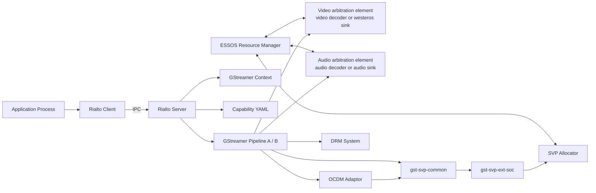
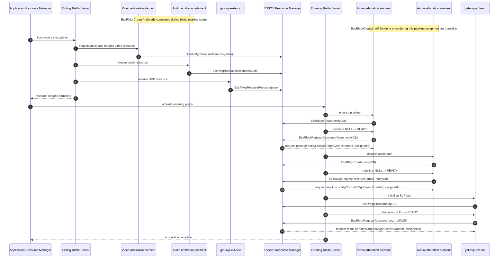
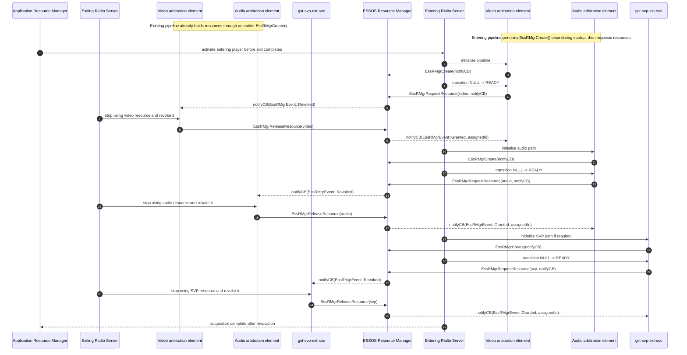
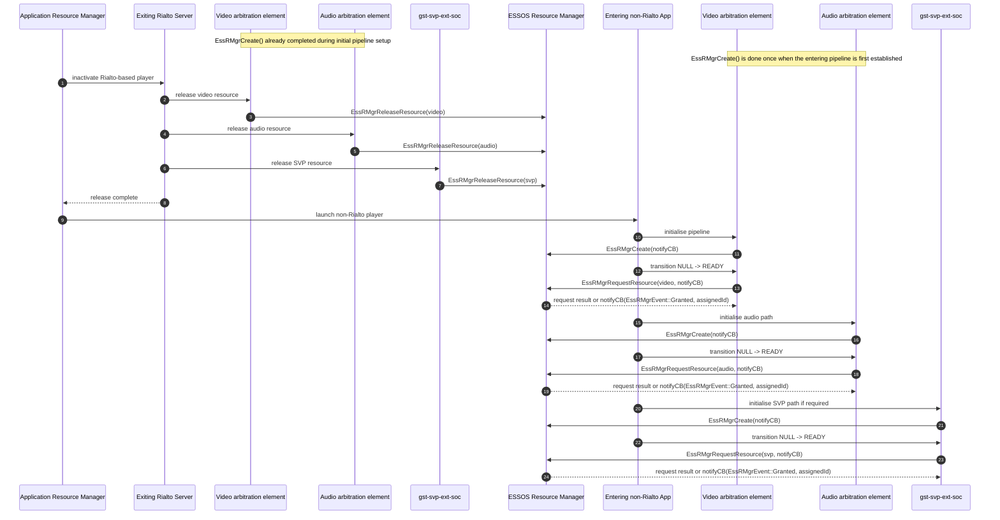
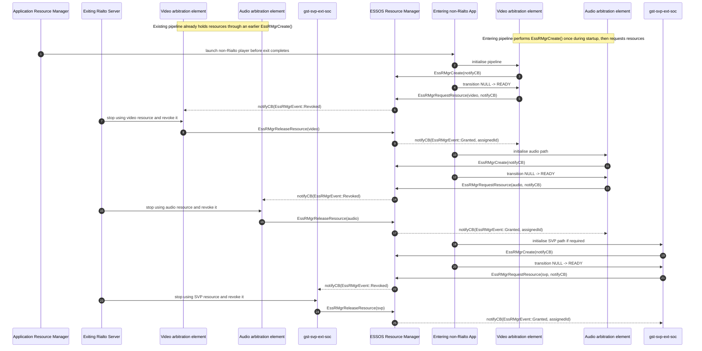
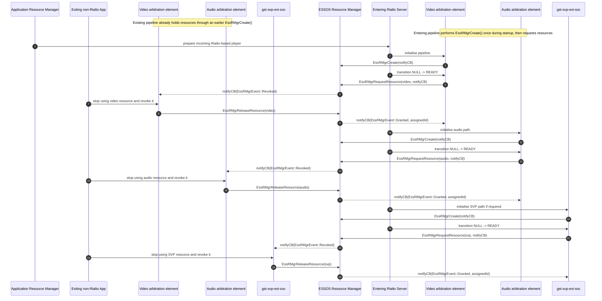
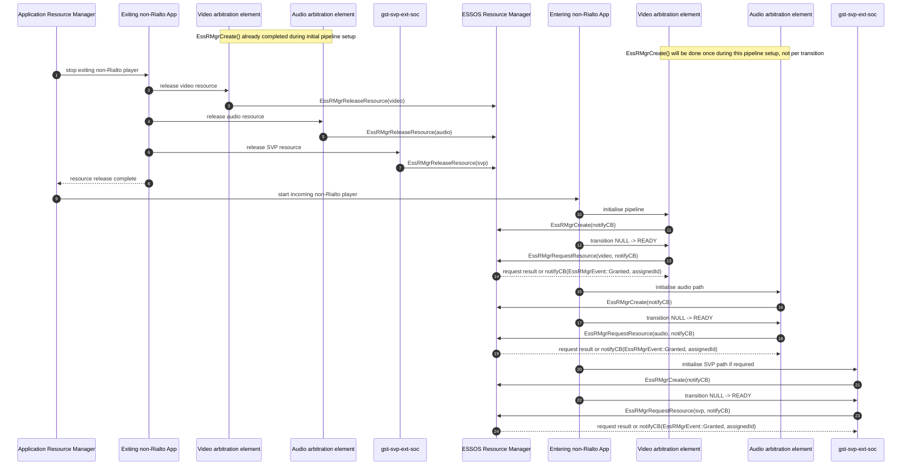
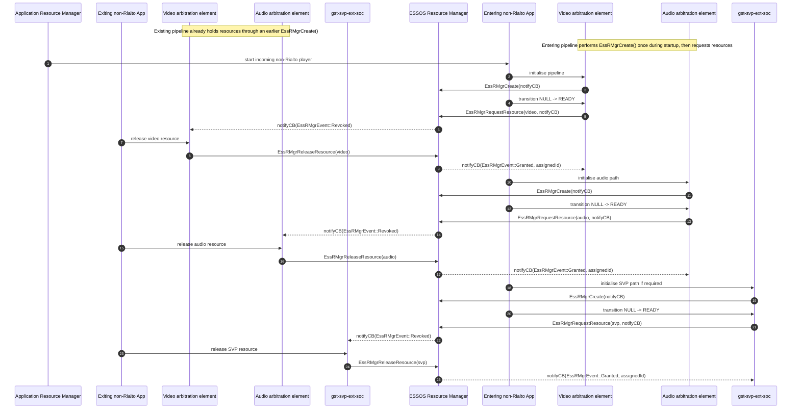

# DPI9 Legacy AV HAL Extension Specification

**Status:** Draft for review.

**Specification version:** 0.1

## Revision history

| Version | Status | What changed | What reviewers should check |
|---|---|---|---|
| 0.1 | Draft for review | First version of the DPI9 legacy AV HAL extension specification covering concurrent playback property extensions and AV resource-management requirements. | Property semantics, capability reporting, resource selection, transition behaviour, and ESSOS integration requirements. |

### What this specification covers

- Westeros sink property extensions for `window-group-id` and `window-group-apply`.
- Audio sink property extension for `audio-enable`.
- Video decoder and video plane resource selection using `res-usage`.
- Audio decoder resource handling for symmetric decoders.
- SVP allocator resource handling for asymmetric and symmetric platforms.
- DRM resource expectations for concurrent playback.
- AV player transition and resource-acquisition rules for Rialto and non-Rialto players.

### What this specification does not cover

- Unrelated platform features outside decoder, audio, SVP, DRM, and transition handling.
- Metrics HAL requirements.
- Frame-capture HAL behaviour.

---

## 0. System context and deployment model

This specification defines the contract between the middleware playback stack, vendor GStreamer plugins, and platform resource-management components for DPI9 concurrent playback.



### Process and IPC boundaries

- **Application and Rialto Server** run in separate processes.
- **Rialto Server** owns playback-pipeline construction for Rialto-based players.
- **Rialto Server** does not communicate directly with **ESSOS Resource Manager** in this model.
- **ESSOS Resource Manager** arbitrates resource assignment and returns resource instance identifiers.
- **Video resource arbitration** is performed by either a dedicated video-decoder element or by westeros sink when the platform combines sink and decoder responsibilities.
- **Audio resource arbitration** is performed by either a dedicated audio-decoder element or by audio sink when the platform combines sink and decoder responsibilities.
- **Vendor plugins** use the assigned ESSOS identifiers and GStreamer-context signalling to bind to platform resources.

### Contract scope

This specification defines the contract between:

- **Middleware layer team**, which owns Rialto Client, Rialto Server, and playback orchestration.
- **SoC vendor**, which provides the decoder, sinks, SVP handling, DRM integration, and resource-aware vendor plugins.
- **Vendor layer team**, which integrates the SoC delivery, capability YAML, and ESSOS resource-manager configuration.

---

## 1. Purpose

This specification defines how DPI9 concurrent playback extends the legacy AV HAL surface without redesigning the legacy GStreamer pipeline model.

The goal is to support multiple playback pipelines in a single application process while preserving existing single-pipeline behaviour unless explicitly extended by this document.

The contract covers:

- new or extended sink properties;
- capability declaration and resource identification;
- selection of high-specification and low-specification video resources;
- audio-decoder and SVP resource allocation rules; and
- behaviour during transitions between Rialto-based and non-Rialto-based AV players.

## 2. Roles and responsibilities

| Role | Definition | Responsibilities |
|---|---|---|
| **Middleware layer team** | Owns Rialto Client, Rialto Server, and playback orchestration. | Builds playback pipelines, sets sink properties, propagates GStreamer context, and coordinates player transitions. |
| **SoC vendor** | Provides vendor GStreamer elements and platform resource integration. | Implements westeros sink, audio sink, decoder selection, SVP usage handling, DRM integration, and assigned-resource binding. |
| **Vendor layer team** | Integrates the SoC delivery into the platform image. | Supplies capability YAML, ESSOS resource-manager configuration, and any platform-specific resource identifiers consumed by middleware and vendor plugins. |

## 3. Scope

### In scope

- Single application process owning up to two playback pipelines.
- Pipeline independence for play, pause, seek, and trick mode.
- Independent AV sync per pipeline.
- Capability reporting for concurrent decode, mixing, SVP, and DRM.
- Westeros sink property extensions for grouped window application.
- Audio sink property extension for decode-without-audible-output.
- ESSOS-managed video-decoder, audio-decoder, and SVP resources.
- DRM-session expectations for concurrent playback.
- Resource-acquisition rules during AV player transitions.

### Out of scope

- Platform topics unrelated to decoder, audio, SVP, DRM, and transition handling.
- Metrics collection and Metrics HAL behaviour.
- Frame-capture behaviour and APIs.
- A redesign of the legacy GStreamer pipeline topology.

## 4. Architecture facts and assumptions

### 4.1 Architecture facts

- A single application process may own multiple playback pipelines.
- For DPI9 the initial requirement is a maximum of two playback sessions in one application process.
- Each pipeline operates independently and keeps its own play, pause, seek, and trick-mode state.
- AV sync is maintained independently inside each pipeline. No AV synchronisation is required between pipelines.
- Existing SoC-vendor behaviour for a single playback pipeline remains unchanged unless explicitly extended by this specification.

### 4.2 Assumptions

- Legacy pipeline construction remains unchanged.
- New functionality is delivered primarily through sink properties, GStreamer context, capability YAML, and existing middleware orchestration.
- Unsupported capability requests must fail positively rather than producing undefined behaviour.
- Capability reporting is available before runtime configuration occurs.

### 4.3 Capability reporting

Capability YAML shall report at least the following platform capabilities when supported:

- dual video decode;
- dual audio decode;
- audio mixing support;
- dual SVP support; and
- dual DRM support.

The capability YAML and ESSOS resource-manager configuration shall refer consistently to the same logical resources, including video decoder, audio decoder, video sink, audio sink, SVP allocator, and DRM-related platform identifiers where applicable.

## 5. GStreamer property extensions

### 5.1 Westeros sink property extensions

| Property | Type | Purpose | Required behaviour |
|---|---|---|---|
| `window-group-id` | Integer | Associates multiple westeros sink instances with one window-update group. | Multiple sink instances that share the same non-zero group identifier participate in grouped window updates. |
| `window-group-apply` | Boolean | Controls whether pending rectangle changes apply immediately to the whole group. | When `true`, a rectangle change on one grouped sink shall apply to every sink in the group atomically. When `false`, the change may be stored until grouping is applied. |
| `res-usage` | Enum | Identifies the intended resource profile for the video path. | The property value shall continue to distinguish primary and secondary resource usage and shall participate in video-decoder selection as defined in Section 7. |

#### 5.1.1 `window-group-id`

`window-group-id` groups multiple westeros sink instances so that window-coordinate updates may be applied atomically across those instances.

Example intent:

```text
Westeros Sink A -> group 1
Westeros Sink B -> group 1
rectangle change on Sink A
    -> applied to Sink A and Sink B when group apply is enabled
```

#### 5.1.2 `window-group-apply`

`window-group-apply` determines when grouped rectangle changes take effect.

- If `window-group-id` is set and `window-group-apply` is `true`, a rectangle change shall take effect for every sink in the group.
- If `window-group-id` is set and `window-group-apply` is `false`, a rectangle change may be remembered but shall not be applied to the full group until grouping is enabled.
- If no valid `window-group-id` is set, rectangle changes affect only the specified sink instance.

The exact behaviour when sinks in the same group hold different `window-group-apply` values is implementation-defined unless a stricter platform policy is documented. Platforms should avoid mixed configuration within one group.

### 5.2 Audio sink property extension

| Property | Type | Purpose | Required behaviour |
|---|---|---|---|
| `audio-enable` | Boolean | Controls whether decoded audio is forwarded to the audio mixer. | When `true`, decoded audio shall be rendered through the normal mixer path. When `false`, decode shall continue, AV sync shall still be maintained, and audio output shall not be rendered or mixed. |

#### 5.2.1 `audio-enable`

`audio-enable` supports focus modes where both pipelines continue decoding, but only one pipeline is audible.

When `audio-enable` is `false`:

- the audio decoder shall continue decoding;
- the hidden audio stream shall continue to be consumed sufficiently to preserve AV synchronisation;
- decoded audio shall not be injected into the audible mixer path; and
- audio underflow events for that disabled stream shall not be reported.

When a stream is initialised, it should default to the enabled state.

### 5.3 Property application timing

- `res-usage` shall be set before the pipeline moves from `NULL` to `READY`, because the resource-owning element may request its ESSOS-managed resource during that transition.
- `window-group-id` and `window-group-apply` shall be set before grouped window changes are expected to take effect.
- `audio-enable` may be adjusted while both pipelines remain active, provided the platform preserves the decode-and-sync semantics defined above.

## 6. Resource identification model

Resource selection across middleware and vendor plugins relies on consistent identifiers and usage signalling.

The platform shall provide:

- capability YAML describing available concurrent-playback resources;
- ESSOS resource-manager configuration listing the concrete instances for those resources; and
- a stable mapping between logical usage and the assigned ESSOS resource identifiers used by vendor plugins.

The following principles apply:

- middleware decides intent, such as high-specification versus low-specification video decode;
- ESSOS Resource Manager decides the assigned resource instance;
- vendor plugins open the concrete resource selected by the `assignedId` returned by ESSOS; and
- GStreamer context is used where this specification requires usage signalling that must be visible to elements other than the sink that received a direct property.

## 7. Video decoder and video plane resource model

### 7.1 General requirements

All AV players supporting dual video decode shall use Rialto middleware for the concurrent-playback use case.

The platform shall support resource selection between a high-specification video decoder path and a low-specification video decoder path.

### 7.2 `res-usage` signalling and precedence

The middleware shall propagate the `res-usage` value through GStreamer context in addition to setting the `res-usage` property on westeros sink.

This dual signalling exists to support both of these cases:

- DPI9-capable platforms, where vendor plugins rely on GStreamer context to choose the appropriate decoder resource before data flow begins.
- Legacy platforms, where westeros sink property handling remains the deciding mechanism.

When the GStreamer-context value and the westeros sink property differ, the westeros sink property value shall take precedence.

### 7.3 Resource-class mapping

For platforms implementing asymmetric video resources:

- `res-usage = 7` indicates the high-specification decoder profile using full resolution, full quality, and full performance.
- `res-usage = 0` indicates the low-specification decoder profile.

The `res-usage` value shall be established before the pipeline transitions from `NULL` to `READY`, so that decoder selection can complete when the resource-owning element first requests the video decoder.

### 7.4 ESSOS interaction

The video resource-owning element, following the westeros-sink pattern, shall create its ESSOS Resource Manager connection once for the lifetime of the playback pipeline and shall request the video decoder during the GStreamer `NULL` to `READY` transition.

ESSOS Resource Manager shall return the appropriate video-decoder instance identifier through `assignedId` in the resource request result, either immediately from the request call or asynchronously through the registered notify callback.

The vendor video plugin shall use the returned `assignedId` to open the concrete video-decoder instance.

If ESSOS later issues a revoke event for that decoder, the owning element shall stop using the decoder, release any vendor-side resources associated with it, and call `EssRMgrReleaseResource()` before another player is granted the same decoder.

When playback is torn down and ESSOS communication is no longer required, the owning element shall destroy its ESSOS Resource Manager connection.

For legacy AV players not using Rialto:

- only one video decoder is typically requested;
- the default usage value is the high-specification profile; and
- the higher-specification decoder identifier is therefore expected.

### 7.5 Video plane relationship

The high-specification video decoder is expected to pair with the high-specification video plane and PQ pipeline.

The low-specification decoder and associated plane may omit support for Dolby Vision or other PQ features on some platforms. That limitation shall be reflected in platform capability reporting.

## 8. Audio decoder resource model

### 8.1 General requirements

All AV players supporting dual audio decode shall use Rialto middleware for the concurrent-playback use case.

Audio decoder resources are treated as symmetric. This specification does not require an extension to an audio-usage enumeration analogous to the video `res-usage` profile.

### 8.2 ESSOS configuration and allocation

The ESSOS resource-manager configuration shall be extended to advertise both available audio-decoder resources.

When middleware requests an audio decoder:

- the first request shall receive the first available audio-decoder `assignedId`;
- the second request shall receive the second available audio-decoder `assignedId`; and
- no further usage-class distinction is required for symmetric audio decoders.

### 8.3 Vendor plugin behaviour

The audio sink or audio-decoder plugin that consumes ESSOS resource-manager results shall use the returned `assignedId` to decide which hardware audio-decoder instance to open.

The mapping from `assignedId` to the actual hardware decoder instance remains private to the vendor implementation.

The audio resource-owning element shall follow the same ESSOS communication lifecycle as the video case: create its ESSOS connection once for the lifetime of the playback pipeline, request the audio decoder during `NULL` to `READY`, accept either an immediate `assignedId` or an asynchronous callback grant, and release the resource with `EssRMgrReleaseResource()` when playback stops or when a revoke event is received.

When ESSOS communication is no longer required for that pipeline, the element shall destroy its ESSOS connection.

For legacy AV players not using Rialto, only one audio decoder is typically requested.

## 9. Audio mixer resource model

### 9.1 Process-scoped mixer ownership

Audio-mixer usage for main and secondary audio inputs is tied to the Linux process that is currently using the mixer resource, such as an application process or a Rialto Session Server process.

For the purposes of this specification, process ownership applies to the media-stream inputs that feed the main and secondary mixer paths. It does not change the behaviour of other platform audio sources that are already allowed to mix through the existing audio system.

### 9.2 Behaviour during process handover

When a new Linux process starts using the audio mixer resource, the SoC vendor implementation shall ensure that any audio data still being injected by another process for primary or secondary playback inputs is ignored and is not mixed into the audible output.

This requirement applies to transitions involving both of these process categories:

- an application process using the legacy playback path; and
- a Rialto Session Server process using the Rialto-based playback path.

The purpose of this rule is to prevent stale or overlapping playback audio from an exiting process from leaking into the mixer while the entering process takes ownership of the playback audio path.

### 9.3 Non-playback audio sources

Application audio, System Audio, and TTS audio shall continue to be handled according to the existing platform mixing behaviour.

These audio classes are not excluded by the process-scoped ownership rule for main and secondary playback inputs. Any such input from any Linux process may continue to be mixed as supported by the platform's existing audio policy.

### 9.4 Conformance requirement

The SoC vendor shall provide mixer-input isolation such that a new owner of the playback mixer path cannot receive residual main or secondary audio injected by an older process once handover has occurred.

## 10. SVP allocator resource model

### 10.1 General requirements

All AV players supporting dual secure-video paths shall use Rialto middleware for the concurrent-playback use case.

Platforms shall declare whether their SVP allocator resources are asymmetric or symmetric.

### 10.2 Asymmetric SVP resources

On platforms where SVP allocator resources are asymmetric, middleware shall signal SVP usage through GStreamer context.

The recommended logical usage values are:

- `EssRMgrSVPAUse_fullResolution` for the UHD-capable pool; and
- `EssRMgrSVPAUse_none` for the FHD-capable pool.

On such platforms:

- ESSOS resource-manager configuration shall define both the UHD SVP pool resource and the FHD SVP pool resource;
- the Rialto path shall propagate SVP usage through GStreamer context before the first secure-buffer consumer binds the allocator;
- the first component that consumes the SVP buffer, such as a decryptor or SVP payload element, shall pass the usage to the vendor-side SVP integration; and
- vendor code shall use the usage value together with the assigned resource identifier to bind the correct allocator resource.

The SVP resource-owning element shall create its ESSOS connection once for the lifetime of the playback pipeline, request the SVP allocator during the initial pipeline-establishment path before secure playback depends on that allocator, and handle grant or revoke using the same ESSOS request/callback/release pattern used for video.

### 10.3 Symmetric SVP resources

On platforms where SVP allocator resources are symmetric:

- the SVP usage flag need not be signalled through GStreamer context for allocator selection;
- ESSOS resource-manager configuration shall define the allocator resources symmetrically; and
- the assigned ESSOS identifier alone is sufficient for vendor-resource binding.

Even on symmetric platforms, the SVP-owning element shall keep a persistent ESSOS connection for the lifetime of the playback pipeline, release the allocator with `EssRMgrReleaseResource()` when playback stops or a revoke event is received, and destroy the ESSOS connection only when resource-manager communication is no longer needed.

### 10.4 Legacy behaviour

For legacy AV players not using Rialto:

- only one SVP allocator is typically requested; and
- the default expectation is the higher-specification allocator when such differentiation exists.

## 11. DRM resource model

### 11.1 General requirements

Dual-DRM support is required only for video paths. Audio remains clear for the DPI9 use case described by this specification.

DRM resources are not managed by ESSOS Resource Manager.

### 11.2 Provisioning expectations

The platform shall provision the relevant key identifiers for the playback session before the GStreamer pipeline is constructed.

Encrypted video data passed during decryption shall carry sufficient key-identification information for the DRM implementation to select the correct decryption key.

### 11.3 Concurrency expectations

The DRM implementation shall support the number of simultaneous key sessions required by the concurrent playback design adopted on that platform.

Platforms should document any practical concurrency limit, especially during transitions where the exiting player has not yet fully released DRM-related state before the new player begins initialisation.

## 12. AV player transitions and resource acquisition

### 12.1 General transition rules

Resource management during AV player transitions shall prevent mixed ownership of decoder, plane, audio-decoder, or SVP resources.

The application manager or equivalent playback orchestrator shall coordinate activation and inactivation so that resources held by an exiting player are released before the entering player relies on them, unless a documented forced-revocation path is used.

**Note:** ESSOS Resource Manager, which corresponds to the legacy vendor-layer revocation method in this specification, is the fallback resource-management model when the application resource manager does not provide smooth handover of video, audio, and SVP resources during transition from one application to another.

This fallback is a mandatory requirement because not all applications use Rialto and the platform therefore requires one resource-management model that can arbitrate mixed transitions across Rialto-based and non-Rialto-based applications.

Audio-mixer behaviour remains process-specific and shall follow the ownership and isolation rules defined in Section 9.

Within one AV pipeline, `EssRMgrCreate()` shall be called once during playback setup. Following the westeros-sink resource-manager pattern, the resource-owning element shall request its ESSOS-managed resource during the first transition from GStreamer `NULL` to `READY`. The grant may be delivered immediately through the request result or later through `EssRMgrNotifyCB`, which carries the relevant `EssRMgrEvent`. `EssRMgrDestroy()` shall be called only when ESSOS resource-manager communication is no longer required for that pipeline.

### 12.2 Rialto-based AV player to Rialto-based AV player

For transitions between two Rialto-based players:

- the application manager is responsible for coordinating release and reacquisition of AV resources;
- the exiting Rialto Server shall release video decoders, audio decoders, and SVP allocators before the next Rialto Server acquires them; and
- the entering player shall wait for release confirmation before activating resource acquisition.

If a platform uses a legacy vendor-layer revocation method instead of an orderly release, the implementation shall ensure that both video resources are revoked together when necessary to avoid blending video from the exiting player with video from the entering player.

Orderly-release path, where the exiting player releases resources before the entering player requests them:



Delayed-release path, where the entering player requests resources before the exiting player has released them and ESSOS triggers revocation through `notifyCB`:



### 12.3 Rialto-based AV player to non-Rialto-based AV player

For transitions from a Rialto-based player to a non-Rialto-based player, the required behaviour is equivalent to the Rialto-to-Rialto case from a resource-safety perspective.

The platform may use:

- orderly release coordinated by the application manager;
- a legacy vendor-layer revocation method,

provided the selected method prevents overlapping ownership that could lead to mixed video output.

Orderly-release path, where the exiting Rialto-based player releases resources before the entering non-Rialto player requests them:



Delayed-release path, where the entering non-Rialto player requests resources before the exiting Rialto-based player has released them and ESSOS triggers revocation through `notifyCB`:



### 12.4 Non-Rialto-based AV player to Rialto-based AV player

For transitions from a non-Rialto-based player to a Rialto-based player:

- release may need to occur through a legacy method because the exiting player may not explicitly release resources before shutdown;
- if shutdown is delayed, ESSOS or the vendor layer may need to force revocation before the new Rialto-based player acquires the resource; and
- if the entering Rialto-based player acquires the lower-specification video decoder first while the exiting non-Rialto player still owns the higher-specification decoder, the platform shall avoid any temporary mixed-video presentation.

Platforms that cannot guarantee this through orderly release shall revoke both video resources together when needed.

Orderly-release path, where the exiting non-Rialto player releases resources before the entering Rialto-based player requests them:


Delayed-release path, where the entering Rialto-based player requests resources before the exiting non-Rialto player has released them and ESSOS triggers revocation through `notifyCB`:



### 12.5 Non-Rialto-based AV player to non-Rialto-based AV player

For transitions between two non-Rialto-based AV players, release occurs through the legacy platform method.

This specification does not require Rialto-specific coordination in that case, but the platform shall still preserve exclusive ownership of the relevant AV resources.

Orderly-release path, where the exiting non-Rialto player releases resources before the entering non-Rialto player requests them:



Delayed-release path, where the entering non-Rialto player requests resources before the exiting non-Rialto player has released them and ESSOS triggers revocation through `notifyCB`:



## 13. Audio behaviour in dual-decode modes

This specification does not redefine the application-facing audio UX policy, but the platform shall support at least these behavioural classes when declared by capability YAML:

- **Dual decode + dual mix**: both audio streams decoded and mixed, with independent volume control.
- **Dual decode + single audible output**: both streams continue decoding, but one stream may be made inaudible through `audio-enable` or equivalent volume policy while AV sync is preserved.
- **Single audio decode + dual video decode**: only the primary stream performs audio decode, while the platform still supports other platform audio inputs as defined by the existing mixer design.

## 14. Conformance and acceptance gates

An implementation is conformant only when all of the following are true:

| # | Requirement |
|---|---|
| 1 | Existing single-pipeline behaviour remains unchanged unless extended by this specification. |
| 2 | Up to two playback pipelines in one application process can be represented by capability reporting when supported. |
| 3 | `window-group-id` groups sink instances for atomic multi-window updates. |
| 4 | `window-group-apply` controls whether grouped rectangle changes apply immediately across the group. |
| 5 | `audio-enable=false` preserves decode and AV sync while suppressing audible output and underflow reporting for that disabled stream. |
| 6 | `res-usage` is available early enough to select the appropriate video decoder before the `NULL` to `READY` resource request is issued. |
| 7 | GStreamer context and westeros sink property signalling coexist, with the direct sink property taking precedence on conflict. |
| 8 | ESSOS `assignedId` values are used by vendor plugins to open the selected video-decoder and audio-decoder instances. |
| 9 | Audio decoder resources are treated symmetrically and are represented as multiple configured resources in ESSOS. |
| 10 | Audio mixer ownership for main and secondary playback inputs is process-scoped, and an entering process is isolated from stale playback audio injected by an exiting process. |
| 11 | Asymmetric SVP platforms signal SVP usage and provide separate UHD and FHD allocator resources in ESSOS configuration. |
| 12 | Symmetric SVP platforms do not require usage-based allocator selection and may define allocator resources symmetrically. |
| 13 | DRM-session provisioning occurs before pipeline construction and supports the platform's declared concurrent playback model. |
| 14 | Transition handling prevents mixed ownership that would produce overlapping or blended video from exiting and entering players. |
| 15 | Audio from an exiting process is ignored once the mixer is in use by the entering process, consistent with process-scoped mixer ownership. |
| 16 | ESSOS Resource Manager support is available as the mandatory fallback resource-management model for cross-application transitions when the application resource manager does not provide smooth handover. |

Failure of any mandatory gate means DPI9 concurrent playback is unsupported on that implementation or supported only within a narrower capability set explicitly declared by the platform.

## 15. Clarifications and implementation notes

The following points should be documented by each platform implementation where relevant:

- the exact ESSOS resource identifiers used for high-specification and low-specification video resources;
- whether the platform's SVP resources are asymmetric or symmetric;
- any platform-specific limit on concurrent DRM sessions during steady state or transition;
- any restriction on concurrent Dolby or other high-cost audio decode combinations; and
- the platform policy for inconsistent `window-group-apply` values within one `window-group-id`.

## 16. Risk and blocking factors

Concurrent playback depends on synchronous state management between the application manager and the Rialto Server processes involved in transitions.

The platform shall not activate a new Rialto Server instance for resource acquisition until the exiting instance has been inactivated and resource release has either completed or been forcefully and safely enforced by the selected platform policy.