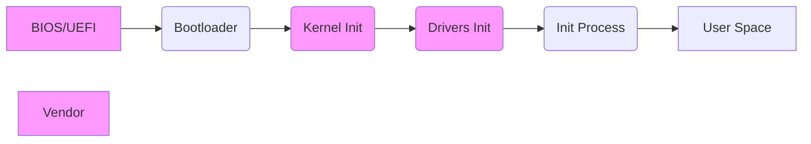
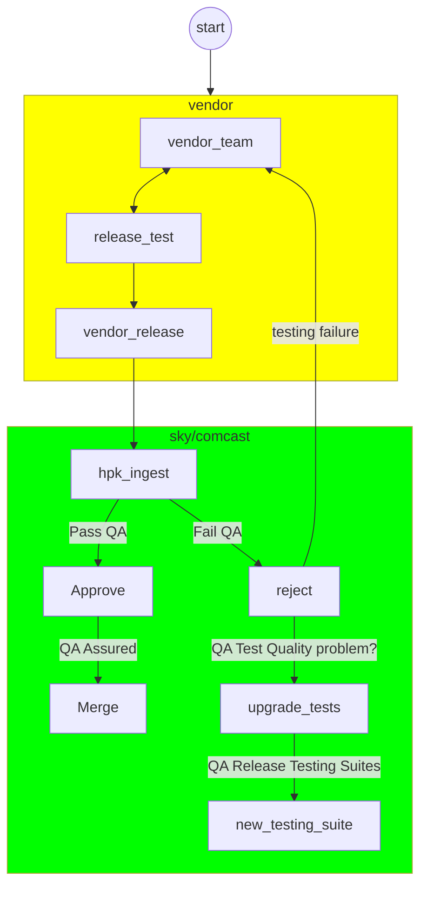
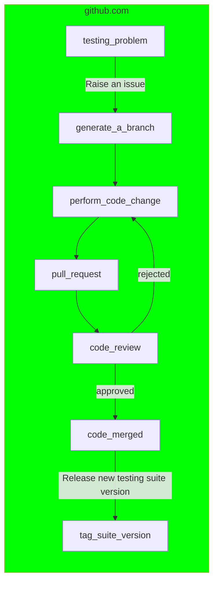

# Integration with Vendors via the Hardware Porting Kit (HPK)

## Scope

The document outlined below sets forth the prerequisites for a vendor in setting up a layer and synchronizing its expectations for a merge into the vendor layer, utilizing the `Hardware Porting Kit - HPK`. This documentation is specifically for situations where vendors are expected to interact and integrate with Comcast and Sky stacks.

## History

|Version|Comment|Author|
|--------|------|-------|
|0.3.0| Added toolchain, Ingest Process, Collaboration |Ulrond|
|0.2.0| Upgrade to include Ingest |Ulrond|
|0.1.0| First Release|Ulrond|

## Acronyms

- `CPE` - Customer premises equipment
- `HPK` - RDK Hardware Porting Kit
- `Yocto` - [Yocto Build System](https://www.yoctoproject.org/)
- `vendor layer` - Vendor Platform Specific Stack Layer
- `dunfell` / `kirkstone` - `Yocto` release versions
- `HALIF` - HAL Interfaces

## Boot Sequence to consider

Consider the boot-sequence of the `CPE` device, this is split by multiple suppliers

- **BIOS/UEFI**: When the system is powered on, BIOS/UEFI firmware initiates. It sets up the system hardware and loads the bootloader from the boot disk. (**Vendor Specific**)
- **Bootloader**: Responsible for loading the kernel into memory. (**Sky/Comcast**)
- **Kernel Initialisation**: Once the Kernel is in memory, it initialises the system settings, memory, hardware, and more. (**Kernel + Patches from Vendor**)
- **Device Drivers Initialisation**: Kernel activates all the necessary device drivers. (**Vendor Soc Drivers + Sky/Comcast: Board Drivers**)
- **Init Process**: Init process runs several scripts for the run level specified. (**Sky/Comcast**)
- **User Space**: Control is transferred to the User Interface will be shown for the customer (**Sky/Comcast**)



## Requirements for Integration

Review of the requirements for integration and next steps to find out focus area's to understand them.

In order to simplify the integration between any vendor and Comcast `yocto` environment, the vendor needs to sync on area's below. But in essence each of the area's need to be built independently, and Sky/Comcast will setup `yocto` recipes, to trigger the area's for building, and provide the requirements for linking.

Expected that Sky/Comcast will supply a `vendor` layer template. Which will setup the requirements for the build system, but this isn't required to be used by the `vendor`. It's completely possible for the vendor to keep their current build system, and deliver component area's for cloning and building.

|Area|Requirement|Action|
|----|------------|-----|
|RDK Wrapper for Vendor| Vendor to implement wrapper to RDK| **Sky**: Delivery of HAL's via rdkcentral & L1-L3 Test Suites, **Vendor**: Implementation|
|OSS | Requirements are fixed and come from OSS Team in Comcast| **Vendor**: list out all OSS & patches, **Sky/Comcast**: Compare versions & patches|
|Kernel Modules| Kernel Modules need to be built independently| **Sky/Comcast**: Generate list, **Vendor**: Build system review / small footprint clone |
|Driver Init| Understand requirements for booting drivers| **Sky/Comcast**: List out all requirements, **Vendor**: Review with Sky requirement|
|Kernel | Alignment on Version 5.15_13 required | **Sky/Comcast**: Check `kirkstone` version for info **Vendor**: Provide Version requirements  |
|Kernel Configuration | Alignment on config | **Sky/Comcast**: Extract from current builds, **Vendor**: Provide configuration requirements|
|Kernel Patches | Alignment on patches required| **Vendor**: Check what is patched |
|Toolchain - GCC/Clang | Version alignment, driven by `kirkstone` in the first instance| **Sky/Comcast**: to provide shared docker|

### RDK Wrapper for Vendor

The vendor is expected to implement a wrapper interface from their drivers to the `RDK HPK`, the header files and the testing suites are shared via [github.com/rdkcentral](https://github.com/rdkcentral/rdk-hpk-documentation/blob/main/README.md/)

### OSS

From the list below, we need to understand what is required for the Vendor lower layers:-

`OSS` for the Comcast/Sky environment is fixed, and this is delivered by an internal `OSS` team at Comcast. There should be no platform specific patches, but configurations could be considered depending on the requirements. Although the internal aim is to use as `OSS` vanilla if at all possible.

### Kernel Modules

Kernel modules need to be built independently, so they can be triggered from a `yocto` recipe, vendor can assume that the requirements have been met before the make system is called.

### Driver Init

Understand requirements for booting drivers, this will be feed into the SystemD configuration for booting the platform.

### Kernel

Alignment on version based on the requirements to support both Comcast requirements and the vendor requirements. At the time of writing this will be at least version 5.15.

### Kernel Configuration

Alignment on config, shared via both parties so that building of the kernel both sides can be achieved.

### Kernel Patches

Alignment on patches required, vendor to provide list of patches required.

### Toolchain

Version alignment, driven by `kirkstone` in the first instance, this will be shared via a docker.

`glibc` - is delivered by the toolchain docker image. And therefore the requirements is driven  be consistent between vendors and based on the version of `yocto` that's currently being used.

Vendor will be responsible for allowing overrides in their build system to support external toolchain, this toolchain will be shared via our dockers.

Example configuration for the variables is as follows, ( this is based on `dunfell` and not `kirkstone`  in this version of the document)

```bash
export SDKTARGETSYSROOT=/opt/toolchains/rdk-glibc-x86_64/sysroots/armv7at2hf-neon-rdk-linux-gnueabi
export PATH=/opt/toolchains/rdk-glibc-x86_64/sysroots/x86_64-rdksdk-linux/usr/bin:/opt/toolchains/rdk-glibc-x86_64/sysroots/x86_64-rdksdk-linux/usr/sbin:/opt/toolchains/rdk-glibc-x86_64/sysroots/x86_64-rdksdk-linux/bin:/opt/toolchains/rdk-glibc-x86_64/sysroots/x86_64-rdksdk-linux/sbin:/opt/toolchains/rdk-glibc-x86_64/sysroots/x86_64-rdksdk-linux/usr/bin/../x86_64-rdksdk-linux/bin:/opt/toolchains/rdk-glibc-x86_64/sysroots/x86_64-rdksdk-linux/usr/bin/arm-rdk-linux-gnueabi:/opt/toolchains/rdk-glibc-x86_64/sysroots/x86_64-rdksdk-linux/usr/bin/arm-rdk-linux-musl:"$PATH"
export PKG_CONFIG_SYSROOT_DIR=$SDKTARGETSYSROOT
export PKG_CONFIG_PATH=$SDKTARGETSYSROOT/usr/lib/pkgconfig:$SDKTARGETSYSROOT/usr/share/pkgconfig
export CONFIG_SITE=/opt/toolchains/rdk-glibc-x86_64/site-config-armv7at2hf-neon-rdk-linux-gnueabi
export OECORE_NATIVE_SYSROOT="/opt/toolchains/rdk-glibc-x86_64/sysroots/x86_64-rdksdk-linux"
export OECORE_TARGET_SYSROOT="$SDKTARGETSYSROOT"
export OECORE_ACLOCAL_OPTS="-I /opt/toolchains/rdk-glibc-x86_64/sysroots/x86_64-rdksdk-linux/usr/share/aclocal"
export OECORE_BASELIB="lib"
export OECORE_TARGET_ARCH="arm"
export OECORE_TARGET_OS="linux-gnueabi"
unset command_not_found_handle
export CC="arm-rdk-linux-gnueabi-gcc  -march=armv7-a -mthumb -mfpu=neon -mfloat-abi=hard --sysroot=$SDKTARGETSYSROOT"
export CXX="arm-rdk-linux-gnueabi-g++  -march=armv7-a -mthumb -mfpu=neon -mfloat-abi=hard --sysroot=$SDKTARGETSYSROOT"
export CPP="arm-rdk-linux-gnueabi-gcc -E  -march=armv7-a -mthumb -mfpu=neon -mfloat-abi=hard --sysroot=$SDKTARGETSYSROOT"
export AS="arm-rdk-linux-gnueabi-as "
export LD="arm-rdk-linux-gnueabi-ld  --sysroot=$SDKTARGETSYSROOT"
export GDB=arm-rdk-linux-gnueabi-gdb
export STRIP=arm-rdk-linux-gnueabi-strip
export RANLIB=arm-rdk-linux-gnueabi-ranlib
export OBJCOPY=arm-rdk-linux-gnueabi-objcopy
export OBJDUMP=arm-rdk-linux-gnueabi-objdump
export READELF=arm-rdk-linux-gnueabi-readelf
export AR=arm-rdk-linux-gnueabi-ar
export NM=arm-rdk-linux-gnueabi-nm
export M4=m4
export TARGET_PREFIX=arm-rdk-linux-gnueabi-
export CONFIGURE_FLAGS="--target=arm-rdk-linux-gnueabi --host=arm-rdk-linux-gnueabi --build=x86_64-linux --with-libtool-sysroot=$SDKTARGETSYSROOT"
export CFLAGS=" -Os -pipe -g -feliminate-unused-debug-types "
export CXXFLAGS=" -Os -pipe -g -feliminate-unused-debug-types "
export LDFLAGS="-Wl,-O1 -Wl,--hash-style=gnu -Wl,--as-needed"
export CPPFLAGS=""
export KCFLAGS="--sysroot=$SDKTARGETSYSROOT"
export OECORE_DISTRO_VERSION="2.0"
export OECORE_SDK_VERSION="2.0"
export ARCH=arm
export CROSS_COMPILE=arm-rdk-linux-gnueabi-
```

## Ingesting Code from Vendors

`Sky/Comcast` will use a pull model for ingest via git repositories, unless that's not possible we are able to setup a shared push area for vendor delivery. Sky/Comcast will use that area to activate the pull model. If the vendor would prefer this method this is also possible.

Ideally we should all share a **single source of truth for delivery** that all parties will have access too to ensure sync.

Requirements from Vendors:-

All deliveries will be tested against the `HPK` testing suites, and all changes will require to both be known and and risk assessed.

Complete documentation on all the changes is required to be provided, and ideally in markdown format and committed with the code repositories. And clear tagging of all source code.

- `tag` delivery versions of all repo's must be provided with release notes on changes since previous delivery.
- `CHANGELOG.md` - a combined `CHANGELOG.md` generated by a tool like `auto-changelog` would be expected, which contains all the changes between previous release and current release tag.
- It maybe advisable to populate the ingest `yaml` format, that can be automatically processed at ingest time, this can be provided.



## Collaboration on testing

All of the testing suites for the `HPK` are hosted in the open and in `github.com/rdkcentral`, therefore all parties are free to use, and edit the suites, although changes that will be merged back must be approved via the component owner.

- Therefore If either the  `vendor` or `sky/comcast` have issues with the testing suites, the process is the same, raise an issue on the git repo using the `github` issue system. Create a branch based on the ticket number, perform the change, send the change for review via pull request.
  - Upon approval the next version of the testing suite will be released.
  - Whist being approved the changes are all shared with all parties.



*Note: The `HALIF` interface files are not open to change by 3rd Parties these are the contract API between the RDK Middleware and the Vendors*
