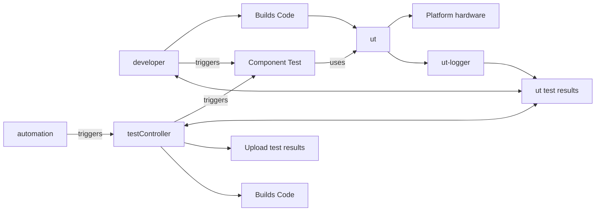
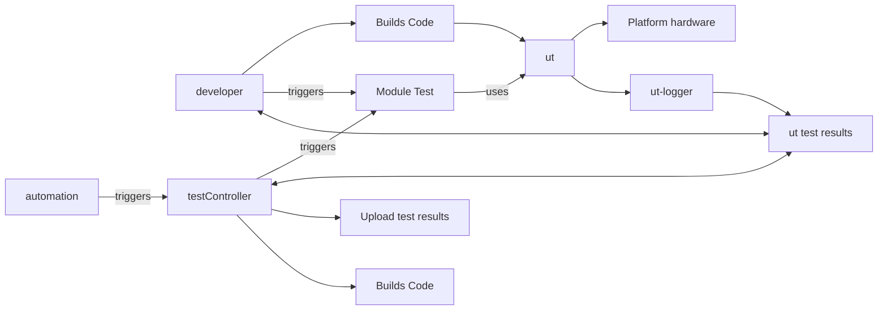
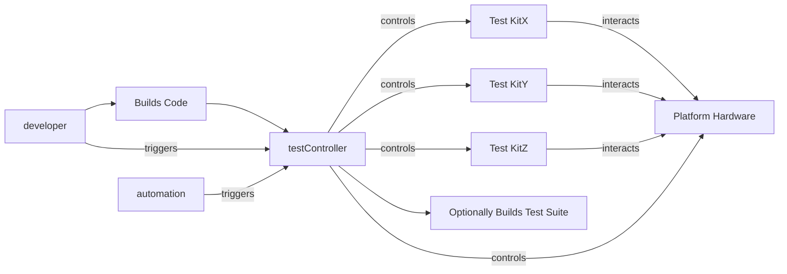
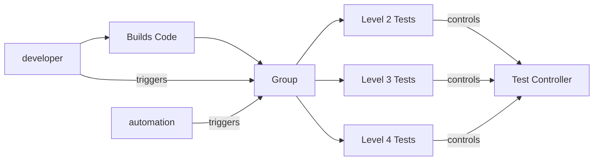

# Testing Procedures and Acceptance Criteria for Components

## Document history

|Version|Author|Date|Changes|
|-------|------|----|-------|
|1.0.1|Ulrond|Feb 2024|Corrected Format|
|1.0.0|Ulrond|Feb 2024|Updated & refactored|
|0.0.1|Ulrond|May 2023|Draft|

## Overview

This document describes the levels of test, and the definition of done for the vendor layers. The target audience are developers, testers and integration engineers.

By defining clear testing levels and a well-defined 'done' state for vendor layers, this document promotes improved functional coverage, reduction of defects, enhancing stability which will streamlined integration and reduce rework.

### Automated Pre-application Testing for Engineering Platform

This testing system aims to comprehensively verify the behaviour of the engineering platform before any applications or layers are loaded. By simulating external influences like power, IR, serial, SSH, and Telnet, the system will:

- **Control the box under test:** Interact with the engineering platform at a low level.
- **Validate the boot sequence:** Ensure the boot process operates flawlessly.
- **Test pre-application functionalities:** Verify any system functionalities present before the kernel fully loads (e.g., diagnostics, hardware initialisation).

Box Characteristics:

- **Development platform:** Primarily used for development purposes.
- **Kernel terminal build:** Runs a basic terminal environment without additional user interfaces.
- **No additional layers:** Operates without application (APPS), middleware (MW), or vendor software at startup.

### Level 1 - Function Testing

**Purpose:**

The Level 1 test suite comprises function-level tests designed to validate consistent interface behavior across various vendor implementations. These tests include both positive and negative scenarios, along with verification of proper parameter value checking.

**Parameter Testing:**

- **Max/Min Values:** Test functions with both maximum and minimum parameter values defined in the documentation.

**Negative Testing:**

- Pass invalid parameters that violate specified limitations or data types.
- Verify each function responds to invalid parameters as documented (e.g., error messages, exceptions).
- Consider edge cases like "invalid valid" values if relevant.

**Positive Testing:**

- Pass valid parameters within defined ranges and data types.
- Verify function results match expected behaviour through independent means (e.g., manual checks, command-line verification).

**Testing Frequency:**

- **Developer Testing:** Run parameter tests before code check-in (expected run: every code change or function addition).

**Automated Testing:**

- **Post-commit:** Run a single execution as part of the review process for final sign-off.

### Level 2 - Module Testing

**Purpose:**

This test level aims to comprehensively verify the module's functionality from an operational perspective, simulating real-world usage patterns.

**Implementation:**

- **Independent application:** The test program executes and builds autonomously on the target platform, independent of the RDK environment.
- **Portable:** After building, the application can be easily copied and run on a separate, already powered-on device.
- **Black-box testing focus:** The application initiates the necessary startup routine for the specific HAL section under test, facilitating black-box testing.
- **Feature-specific testability:** Features will be evaluated individually to determine their suitability for functional testing within this framework.

**Execution:**

- **Developer driven**: Developers run the tests extensively before code check-in (expected runs: hundreds per commit).
- **Automated integration:** The tests can be incorporated into an automated CI/CD pipeline for continuous feedback.
- **Post-commit verification:** A single execution after code commit serves as a final sign-off step within the review process.

### Level 3 Testing: External Device Interaction and Performance

**Purpose:**

This test level focuses on verifying the device's ability to handle external stimuli from connected devices and operate correctly.

**Key points:**

- **Independent testing with external devices:** Utilizes dedicated 3rd-party devices (if necessary) to simulate real-world interactions.
- **Black-box approach:** The testing framework controls the external device and treats the tested module as a black box, evaluating pass/fail criteria.
- **Performance testing**: May include assessing the module's behaviour under varying external device workloads.
- **Developer-driven execution:** Developers perform these tests extensively before code check-in (expected runs: hundreds per commit).
- **Automated post-commit verification:** A single post-commit execution serves as a final sign-off within the review process.

### Level 4: System Integration and Stress Testing (Adhoc)

**Purpose:**

This level focuses on rigorously testing groups of interacting components together, simulating real-world load and potential failure scenarios.

**Methodology:**

- **Grouped delivery testing:** Test suites execute against the entire pre-defined group of components, pushing them to their limits using worst-case scenario profiles.
- **Parallel execution:** Maximize system stress by running tests for multiple groups concurrently.
- **Expanded Level 3 testing:** Integrate worst-case scenarios into Level 3 tests to trigger potential issues originating from this layer.
- **High-level test plan:** Establish a comprehensive plan outlining the intended testing goals and procedures.
- **Low-level test integration:** This level may trigger specific, granular tests from lower testing levels for deeper analysis.
- **Regression testing:** Ensure compatibility and stability by systematically testing against previous layer/group implementations.

### Level 4: Middleware Interoperability Testing

**Purpose:**

This level focuses on verifying seamless interaction between the middleware layer and vendor components through integration tests. These tests, often referred to as "smoke tests", aim to rapidly detect major failures before proceeding with deeper testing.

**Key features:**

- **Focus on middleware and vendor layer**: Tests specifically target the interactions between these two crucial layers.
- **Smoke test approach**: Prioritises quick execution to identify critical interoperability issues early.
- **Interop validation:** Ensures smooth communication and data exchange between middleware and vendor components.

### Level 5: End-to-End Testing and Customer Experience Validation

**Purpose:**

This level simulates real-world scenarios to comprehensively evaluate the entire system's behavior from the customer's perspective. It ensures a seamless and intuitive user experience across all functionalities.

**Key Components:**

- **End-to-End Flow:** Tests cover the complete user journey, starting from initial interaction to delivering the desired outcome.
- **Customer Experience Focus:** Validates that the system is user-friendly, intuitive, and meets customer expectations.
- **Regression Testing:** Verifies functionality remains stable and compatible with previous releases.

## Identifying Root Causes

When issues are detected in Level 4 or 5 tests (causing potential regressions or impacting user experience), a two-pronged approach is used to pinpoint the origin:

**Component-Level Investigation (L2, L3):**

- **Replicating the Issue:** Extend existing L2 and L3 tests to reproduce the problem.
- **Re-verification:** Confirm if previously passed L2 and L3 use cases are still functioning correctly.
- **Expanded L3 Scenarios**: Design new L3 test scenarios to isolate the issue further.
- **Sharing Findings:** If the issue is confirmed in L2 or L3, share new test suites with vendors for replication and joint investigation.

**System-Level Investigation (L4, L5):**

- **Refined Test Cases:** Develop new L4 and L5 test cases to pinpoint or isolate the issue within the broader system interactions.
- **Improved Coverage:** Add these new tests to the overall suite for better future protection.
- **RDK Team Involvement**: Share findings and latest test cases with RDK teams for deeper analysis and resolution.

**Maintaining Comprehensive Coverage:**

- **Continually evaluate:** Regularly review uncovered areas in the testing suite and prioritise their inclusion.
- **Adaptive Expansion:** Extend tests at any level (L2-L5) as needed to address new features or potential risks.

## Definition of Done ( Vendor Layer )

In the following table all tests are expected to be automated.

|Area|Comment|
|----|----|
|APIs are well documented|Required|
|Test Suites are well documented|Required|
|100% of External API methods are covered in tests| Required|
|Critical functionality covered by tests| Required|
|Feature is covered| Features are required to be covered by testing, L2 - L4 is expected |
|Unit Tests meet coverage target and have been peer reviewed| Isofar as it's possible for 3rd Party Code|
|Static code analysis| Passed on code owned by our teams, Reviewed on 3rd Party code for issues|
|L1-L4 tests have been manually ran, before code commit| Tests have been ran locally before commit|
|Approved open source| Where applicable|
|Approved security checks performed| Where applicable|
|Critical functionality is covered by performance tests| Where applicable |
|Tests to prove hardware compliance approval| Have been created and can re-run (ideal)|
|All tests are green | No Flaky tests |
|Feedback loops| Tests are expanded as required to support further clarity and investigations shall expand the testing suites. The reproduction of issues through the testing suites is the goal, so that pass / fail criteria can be expanded over time|

### Vendor Layer: Interface Compliance and Documentation

This section outlines the steps and responsibilities for achieving interface compliance for vendor layers.

**Responsibilities:**

- **Component Architect:** Leads the interface creation process, collaborating with the component owner and leveraging relevant resources.
- **Component Owner:** Provides domain expertise and insights to ensure the interface aligns with component functionality.

**Activities:**

- **Interface Specification:**
  - Develop a clear and concise document outlining the interface's purpose, functionalities, and usage details.
  - Include relevant references, such as the provided guide "How to document an interface".
- **Interface Definition:**
  - Translate the specification into concrete code structures, adhering to established standards.
  - Generate header files that define the interface for developers.
- **Interface Documentation:**
  - Utilize Doxygen to create comprehensive documentation for the interface, based on the definition.
  - Ensure clarity, organization, and alignment with other components' documentation.
- **L1-L4 Testing:**
  - Create specifications for testing the interface across different levels (L1-L4), covering various scenarios and functionalities.
  - Develop autogenerated testing suite requirements to automate testing procedures.
  - Produce L1-L4 documentation in markdown or Doxygen format, providing clear test case descriptions and expected outcomes.

**Benefits:**

- **Improved clarity and maintainability**: Well-defined and documented interfaces enhance understanding and facilitate collaborative development.
- **Efficient testing:** Autogenerated test suites ensure consistent and thorough testing across testing levels.
- **Reduced errors and rework:** Clear documentation minimises ambiguities and potential misunderstandings, leading to fewer errors and rework.
